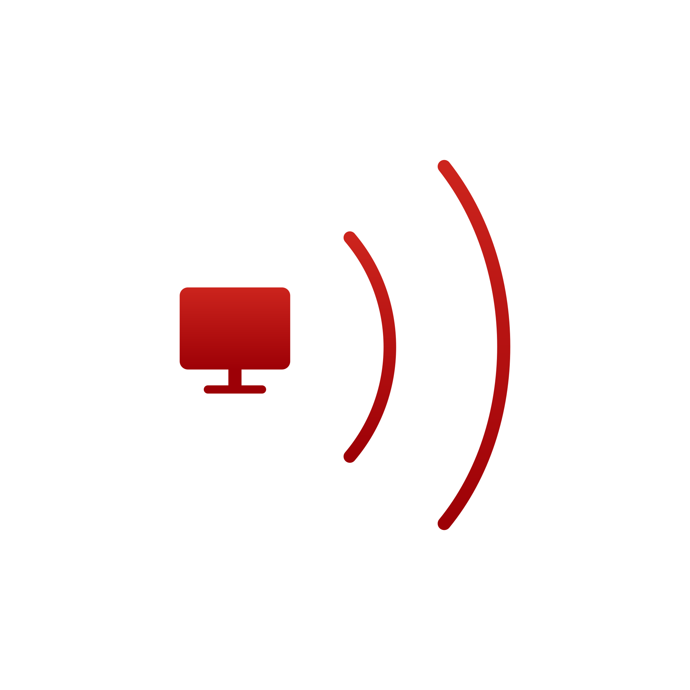
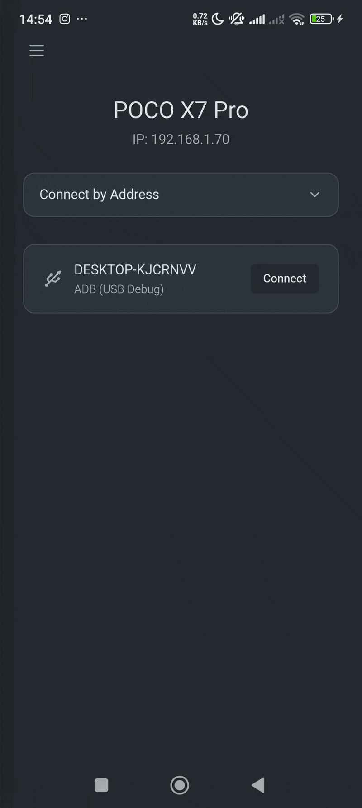
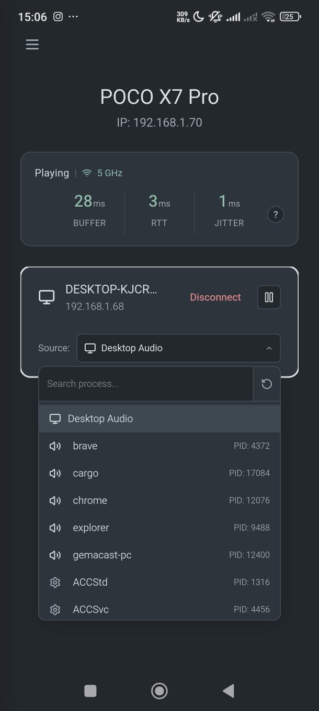
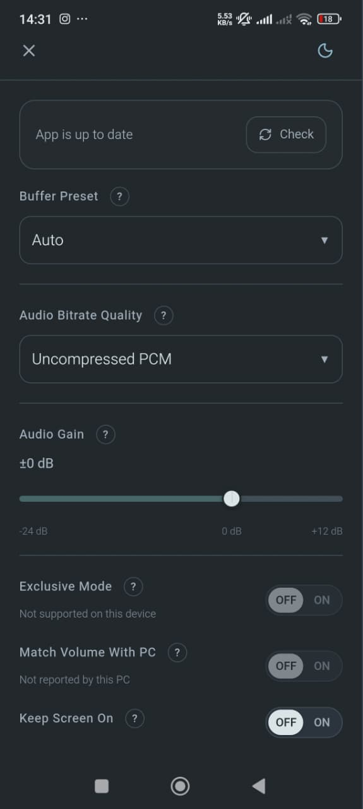
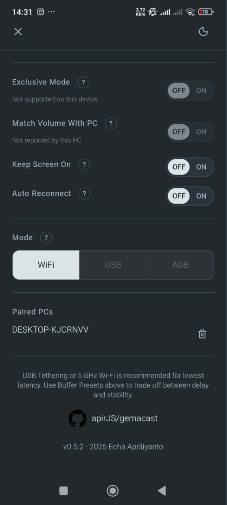
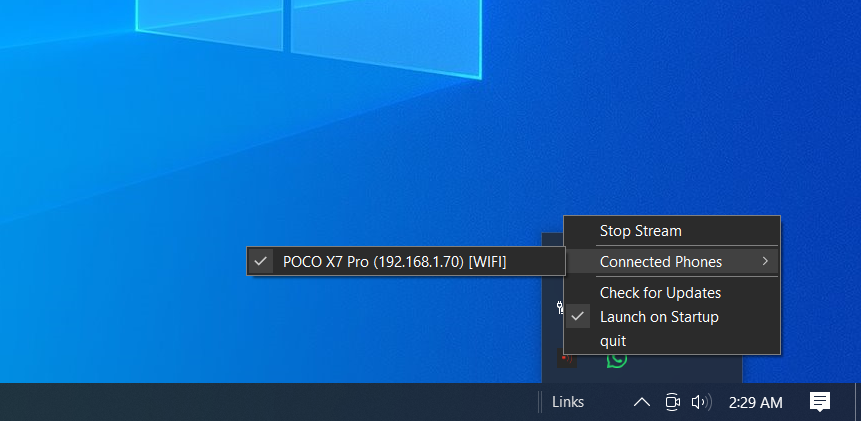

<div align="center">

#  Gemacast

**[gemacast.apirjs.tech](https://gemacast.apirjs.tech/)**

[](https://github.com/apirJS/gemacast/releases/latest)
[](https://www.rust-lang.org/)
[](https://www.typescriptlang.org/)
[](https://github.com/apirJS/gemacast/releases/latest)
[](https://github.com/apirJS/gemacast/commits/main)
[](https://github.com/apirJS/gemacast/releases)
[](LICENSE)
[](https://gemacast.apirjs.tech/)

Stream desktop audio from PC to Android over Wi-Fi, USB tethering, or ADB.
Captures full audio or per-application audio and plays it on one or more phones.<br>Turn your phone into a speaker!!

</div>

## Screenshots

<div align="center">
  
  
  <br /><br />
  
  
  <br /><br />
  
</div>

## Requirements and Setup

### Windows

Minimum: Windows 10 version 2004 or later.

1. Download the `.msi` installer or `.zip` archive from [Releases](https://github.com/apirJS/gemacast/releases/latest).
2. Run the installer. It creates a Windows Firewall rule for ports UDP 23555-23556 and TCP 23559.
3. Launch Gemacast from the Start menu or system tray.

### Linux

Requires a PipeWire 0.3+ session with WirePlumber for audio capture.

Download `.deb`, `.rpm`, `.AppImage`, or `.tar.xz` from [Releases](https://github.com/apirJS/gemacast/releases/latest).

```bash
# Debian / Ubuntu (.deb)
sudo dpkg -i gemacast-pc_*.deb

# Fedora / RHEL (.rpm)
sudo rpm -i gemacast-pc-*.rpm
```

The `.deb` and `.rpm` packages automatically install required UI libraries (GTK3, AppIndicator) and configure firewall rules and port reservations.

For `.AppImage` or `.tar.xz`, you must open ports manually (see [Firewalls](#firewalls)). Additionally, the `.tar.xz` binary requires GTK3 and AppIndicator (e.g., `libayatana-appindicator3-1`) installed on your system to display the system tray icon.

### macOS

Requires macOS >= 13

Download the `.dmg` from [Releases](https://github.com/apirJS/gemacast/releases/latest).

The binary is unsigned and un-notarized. On first launch, right-click the app and select Open, or run:

```bash
xattr -d com.apple.quarantine /Applications/Gemacast.app
```

Audio capture uses ScreenCaptureKit on macOS 13 and later (requires Screen Recording permission).
On macOS 12 or below, CPAL is used as a fallback and requires a virtual output device (BlackHole or Soundflower).

### Android

Minimum: Android 8.0 (Oreo, API 26) or later.

Download the `.apk` from [Releases](https://github.com/apirJS/gemacast/releases/latest) and install it.
The phone and PC must be on the same network, connected via USB tethering, or linked by an ADB cable with `adb reverse` forwarding.

## Features

| Feature | Details |
|---|---|
| Audio capture | Full desktop audio or per-application audio |
| Codecs | Opus LowDelay/CELT at 10-512 kbps, or uncompressed PCM at 48 kHz stereo |
| Multi-device | Stream to multiple Android devices simultaneously with independent settings |
| Secure pairing | TLS control channel with ECDSA P-256 device auth and 6-digit pairing code |
| Adaptive jitter buffer | Per-client buffer depth adjusted to link quality on the audio thread |

## Firewalls

Gemacast uses three inbound ports on the PC. All three must be reachable from the phone's network for Wi-Fi and USB tethering connections.

| Port  | Protocol | Purpose            |
|-------|----------|--------------------|
| 23555 | UDP      | Discovery          |
| 23556 | UDP      | Audio stream       |
| 23559 | TCP      | TLS control (HTTPS)|

ADB connections (TCP 23557, 23558) run over loopback via `adb reverse` and require no firewall rule.

**Windows**: The MSI installer creates rules automatically. For portable installs, allow the ports through Windows Firewall.

**Linux (ufw)**:
```bash
sudo ufw allow 23555,23556/udp
sudo ufw allow 23559/tcp
```

**Linux (firewalld)**:
```bash
sudo cp linux/gemacast.firewalld.xml /usr/lib/firewalld/services/gemacast.xml
sudo firewall-cmd --reload
sudo firewall-cmd --permanent --add-service=gemacast
sudo firewall-cmd --reload
```

**macOS**: Allow incoming connections when the system dialog appears on first launch.

## Audio Formats

| Format       | Codec               | Bitrate          | Frame Size | Latency per Frame |
|--------------|---------------------|------------------|------------|--------------------|
| Opus         | Opus LowDelay/CELT  | 10-512 kbps      | 480 samples | 10 ms             |
| Uncompressed | Raw PCM (f32 stereo)| ~3072 kbps       | 480 samples | 10 ms             |

All formats run at 48 kHz stereo. The capture pipeline resamples any source rate to 48 kHz before encoding.

## Compile from Source

### Prerequisites

| Tool | Version | Notes |
|---|---|---|
| Rust | 1.97.1 | Pinned in `rust-toolchain.toml` |
| Clang | any | Required by `audiopus_sys` (Opus C build) |
| CMake | 3.x | Required by `audiopus_sys` (Opus C build) |
| Bun | 1.x | Frontend build for the mobile app |
| Java | 17 (Temurin) | Android target only |
| Android SDK + NDK | NDK 25.2.9519653 | Android target only |
| cargo-ndk | latest | Android target only (`cargo install cargo-ndk`) |

Linux requires PipeWire, ALSA, GTK3, WebKit2GTK, and related development headers:

```bash
# Debian / Ubuntu
sudo apt-get install -y clang cmake pkg-config ninja-build meson \
  libasound2-dev libpipewire-0.3-dev libgtk-3-dev \
  libayatana-appindicator3-dev libwebkit2gtk-4.1-dev \
  librsvg2-dev patchelf libxdo-dev libudev-dev libdbus-1-dev

# Fedora
sudo dnf install clang cmake pkg-config ninja-build meson \
  alsa-lib-devel pipewire-devel gtk3-devel \
  libayatana-appindicator-gtk3-devel webkit2gtk4.1-devel \
  librsvg2-devel patchelf libxdo-devel systemd-devel dbus-devel
```

### Build PC (Windows / Linux / macOS)

```bash
git clone https://github.com/apirJS/gemacast.git
cd gemacast
cargo build --release -p gemacast-pc
```

The binary is written to `target/release/gemacast-pc` (or `gemacast-pc.exe` on Windows).

### Build Android

```bash
cd gemacast/gemacast-mobile
bun install --frozen-lockfile
bunx tauri android build --apk
```

The unsigned APK is written to `gemacast-mobile/src-tauri/gen/android/app/build/outputs/apk/universal/release/`.

## License

[GPL-3.0-or-later](LICENSE)

## Third-Party Library Acknowledgement

### Rust

| Crate | License | Purpose |
|---|---|---|
| [tokio](https://crates.io/crates/tokio) | MIT | Async runtime |
| [axum](https://crates.io/crates/axum) | MIT | HTTP/WebSocket control server |
| [tao](https://crates.io/crates/tao) | Apache-2.0 / MIT | Window and system tray event loop (PC) |
| [tray-icon](https://crates.io/crates/tray-icon) | Apache-2.0 / MIT | System tray icon (PC) |
| [tauri](https://crates.io/crates/tauri) | Apache-2.0 / MIT | Mobile app framework |
| [opus](https://crates.io/crates/opus) ([audiopus_sys](https://crates.io/crates/audiopus_sys)) | MIT / BSD-3 / ISC | Opus audio codec bindings |
| [oboe](https://crates.io/crates/oboe) | Apache-2.0 | Low-latency audio output (Android) |
| [cpal](https://crates.io/crates/cpal) | Apache-2.0 | Cross-platform audio I/O fallback |
| [pipewire](https://crates.io/crates/pipewire) | MIT | PipeWire audio capture (Linux) |
| [screencapturekit](https://crates.io/crates/screencapturekit) | Apache-2.0 / MIT | Screen/audio capture (macOS) |
| [rubato](https://crates.io/crates/rubato) | MIT / Apache-2.0 | Async sample rate converter |
| [ringbuf](https://crates.io/crates/ringbuf) | MIT / Apache-2.0 | Lock-free ring buffer |
| [mdns-sd](https://crates.io/crates/mdns-sd) | Apache-2.0 / MIT | mDNS service discovery |
| [reqwest](https://crates.io/crates/reqwest) | MIT / Apache-2.0 | HTTP client |
| [rustls](https://crates.io/crates/rustls) | Apache-2.0 / MIT / ISC | TLS implementation |
| [ring](https://crates.io/crates/ring) | Apache-2.0 / ISC / OpenSSL | Cryptographic primitives (ECDSA, SHA-256) |
| [rcgen](https://crates.io/crates/rcgen) | Apache-2.0 / MIT | X.509 certificate generation |
| [serde](https://crates.io/crates/serde) / [serde_json](https://crates.io/crates/serde_json) | MIT / Apache-2.0 | Serialization |
| [rfd](https://crates.io/crates/rfd) | MIT | Native file/message dialogs (PC) |
| [image](https://crates.io/crates/image) | MIT / Apache-2.0 | Image processing for tray icons |
| [semver](https://crates.io/crates/semver) | MIT / Apache-2.0 | Semantic versioning for update checks |

### Frontend (TypeScript)

| Package | License | Purpose |
|---|---|---|
| [react](https://www.npmjs.com/package/react) / [react-dom](https://www.npmjs.com/package/react-dom) | MIT | UI framework |
| [zustand](https://www.npmjs.com/package/zustand) | MIT | State management |
| [tailwindcss](https://www.npmjs.com/package/tailwindcss) | MIT | Utility-first CSS |
| [lucide-react](https://www.npmjs.com/package/lucide-react) | ISC | Icon library |
| [vite](https://www.npmjs.com/package/vite) | MIT | Build tool and dev server |
| [@tauri-apps/api](https://www.npmjs.com/package/@tauri-apps/api) | Apache-2.0 / MIT | Tauri IPC bridge |

### Android (Kotlin)

| Library | License | Purpose |
|---|---|---|
| [Android Keystore API](https://developer.android.com/training/articles/keystore) | Apache-2.0 | Hardware-backed ECDSA key storage |
