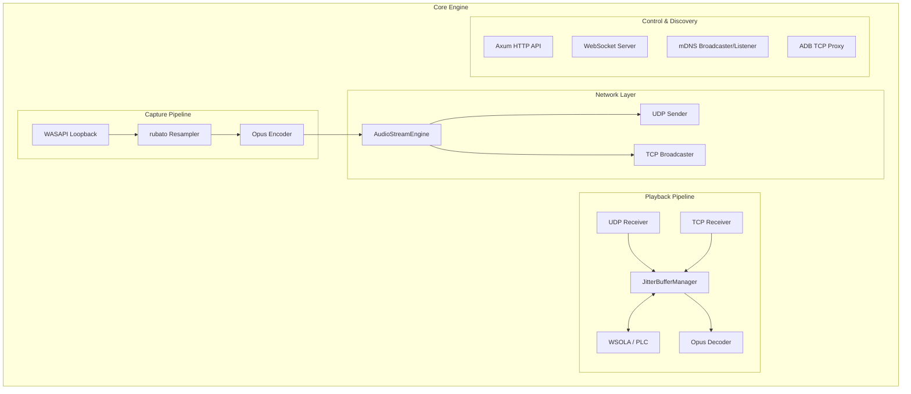

# GemaCast Core Blueprint

This blueprint outlines the architecture, data flow, and file structure of the `gemacast-core` crate.

## Overview

The `gemacast-core` crate is the heart of the GemaCast ecosystem. It is a cross-platform Rust library containing the core engine logic for both the Sender (PC) and the Receiver (Android/Mobile) applications. It abstracts away the complex, low-level details of audio streaming, allowing the `gemacast-pc` and `gemacast-mobile` applications to focus on UI and platform integration.

Key responsibilities include:
- **Audio Capture & Encoding**: Windows WASAPI loopback capture (system-wide and per-process) and Opus encoding.
- **Audio Decoding & Playback**: Advanced adaptive jitter buffering, packet loss concealment (PLC), and WSOLA-based time stretching, followed by Opus decoding.
- **Control Signaling**: An embedded HTTP server (via `axum`) and WebSocket server for connection handshaking, source changing, and real-time event broadcasting.
- **Service Discovery**: Multicast DNS (mDNS) and ADB reverse port forwarding mechanisms to discover peers automatically over Wi-Fi, USB, or ADB.
- **Network Transport**: Transporting raw audio packets over UDP (low latency) or multiplexed TCP (for ADB/USB tunneling).

## Architecture & Data Flow



### 1. Sender (Capture) Flow
- The `AudioStreamEngine` orchestrates streams. When a device subscribes, the engine spins up a `CapturePool` targeting a specific `AudioSource` (either full `Desktop` or a specific `Process`).
- `wasapi_loopback` captures the PCM float data from the Windows audio subsystem. 
- The data is optionally passed through the `CaptureResampler` (to normalize sample rates to 48kHz).
- The `Opus` encoder compresses the PCM into tiny payloads.
- The compressed payload is wrapped in a `RawPacket` (with sequence numbers and timestamps) and sent to the requested target (UDP for Wi-Fi, or TCP for ADB).

### 2. Receiver (Playback) Flow
- Packets arrive from the network (UDP or TCP transport) and are fed into the `JitterBufferManager` via a lock-free SPSC ring buffer.
- The Jitter Buffer computes dual-EMA jitter statistics to dynamically adjust the target buffer depth.
- **WSOLA & PLC**: When packets are lost or network conditions fluctuate, the manager uses Packet Loss Concealment (PLC) to mask drops, and Waveform Similarity Based Overlap-Add (WSOLA) for high-quality audio time-stretching, keeping playback smooth without audible clicks.
- The jitter buffer outputs PCM data decoupled from the original packet boundaries, ready for the native audio backend (CPAL/Oboe) to pull.

### 3. Control & Discovery Flow
- **Sender Side**: Starts an `axum` HTTP server (`/connect`, `/disconnect`, `/sources`) and a WebSocket server (`/ws`). It advertises itself via `mdns-sd`. It also starts an ADB Reverse proxy server on localhost.
- **Receiver Side**: Listens to mDNS for sender announcements. Once discovered, it sends a `POST /connect` to the sender's HTTP API to negotiate the stream (sending its `JitterConfig`, `bitrate`, etc.), and opens a WebSocket to receive real-time errors or disconnect events.

## File Tree & Explanation

```text
gemacast-core/
├── src/
│   ├── audio/           # Core audio definitions
│   │   ├── mod.rs       # Constants (OPUS_SAMPLE_RATE, FRAME_SIZE)
│   │   └── resampler.rs # FFT-based resampling (rubato)
│   │
│   ├── control/         # Control plane and signaling
│   │   ├── http.rs      # Axum REST server
│   │   ├── http_client.rs
│   │   ├── messages.rs  
│   │   ├── types.rs     # Control payloads (ConnectReq, ChangeSourceReq)
│   │   ├── ws.rs        # WebSocket event broadcaster
│   │   └── ws_client.rs 
│   │
│   ├── discovery/       # Service discovery protocols
│   │   ├── mdns.rs      # Multicast DNS (Bonjour/Zeroconf) implementation
│   │   ├── broadcaster.rs
│   │   └── listener.rs
│   │
│   ├── jitter/          # Advanced playback pipeline
│   │   ├── manager.rs   # JitterBufferManager (Dynamic depths, PLC, WSOLA)
│   │   ├── buffer.rs    # Underlying sorted ring buffer
│   │   └── types.rs
│   │
│   ├── network/         # Network utilities
│   │   ├── adb/         # ADB reverse tunneling servers and framing
│   │   │   ├── framer.rs
│   │   │   ├── reverse.rs
│   │   │   └── server.rs
│   │   ├── interface.rs # IP and interface classification (WiFi vs Cellular)
│   │   └── ports.rs     # Shared port constants (TCP/UDP)
│   │
│   ├── stream/          # High-level streaming abstraction
│   │   ├── sender/      # Capture side
│   │   │   ├── capture/ # WASAPI and Process audio capture implementations
│   │   │   ├── capture_pool.rs
│   │   │   ├── encode.rs
│   │   │   └── engine.rs# AudioStreamEngine
│   │   ├── receiver/    # Playback side
│   │   │   ├── listener.rs
│   │   │   ├── stream.rs
│   │   │   └── heartbeat.rs
│   │   └── transport.rs # UDP/TCP traits
│   │
│   ├── error.rs         # Unified GemaCastError definitions
│   ├── types.rs         # Shared domain types (DeviceId, AudioSource, JitterConfig)
│   └── lib.rs
├── Cargo.toml
└── BLUEPRINT.md         # You are here
```

### Notable Complexities
- **Jitter Buffer (`jitter/manager.rs`)**: This is arguably the most complex mathematical component. It uses Exponential Moving Averages (EMA) to track inter-arrival time spikes, runs SIMD-friendly cross-correlation for WSOLA phase alignment, and prevents starvation during network fluctuations.
- **Process Capture (`stream/sender/capture/wasapi_loopback.rs`)**: Implements undocumented Windows Audio Session API features (like `AUDIOCLIENT_ACTIVATION_PARAMS` and `INCLUDE_PROCESS_TREE`) to isolate audio from a specific application tree without capturing the whole desktop.
- **ADB Reverse Multiplexing (`network/adb/server.rs`)**: Because Android allows `adb reverse` over USB, `gemacast-core` starts a TCP server on the PC. Android forwards its local port to the PC's TCP server, bypassing the need for Wi-Fi routing.
