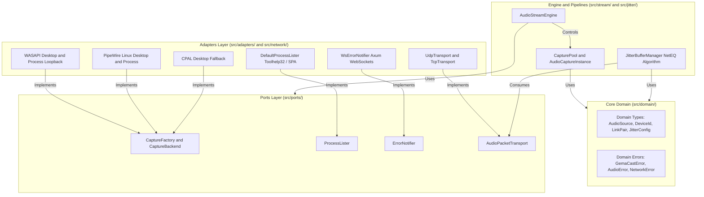
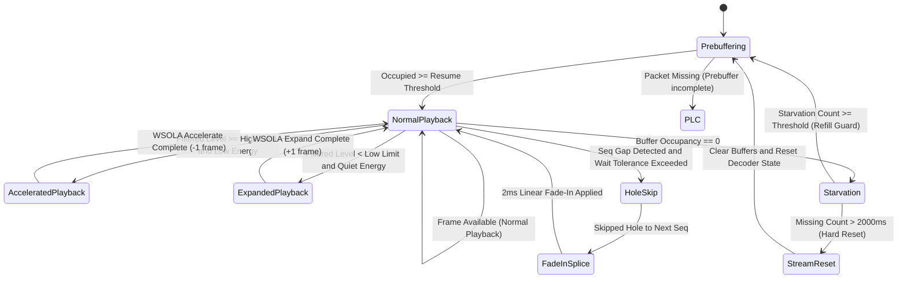
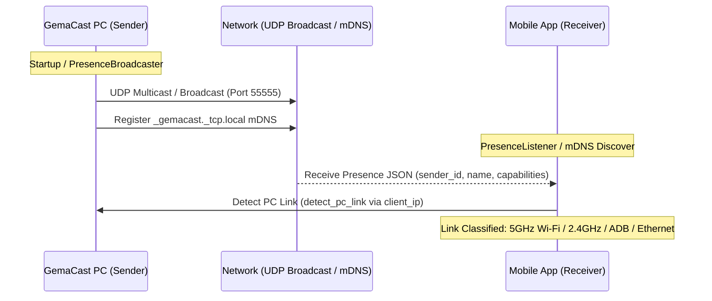
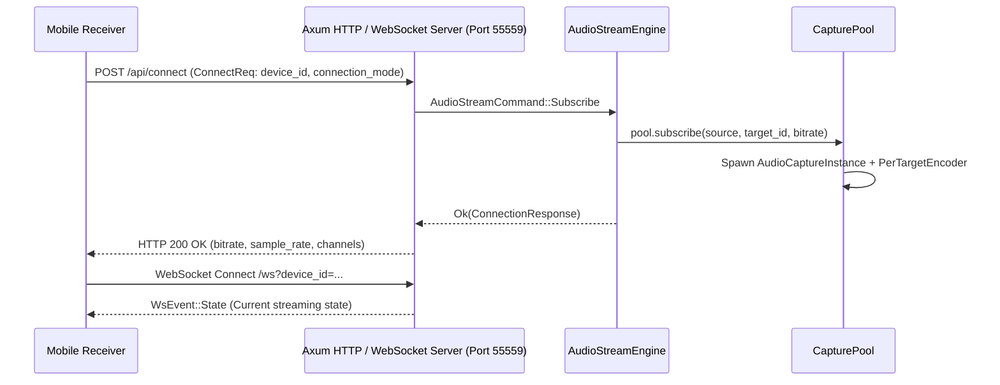
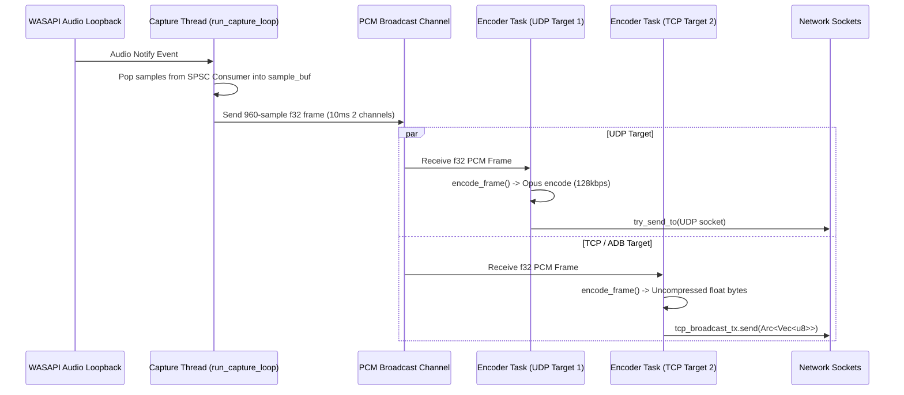
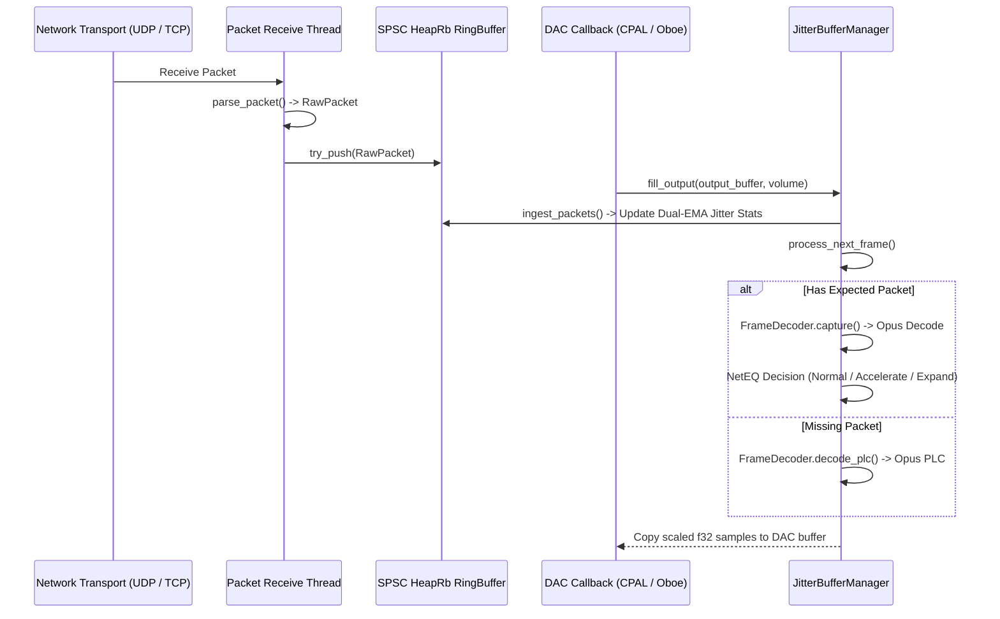

# Gemacast Core Blueprint

## Table of Contents
- [Tree Structure](#tree-structure) L39-L128
- [1. Crate Description Summary](#1-crate-description-summary) L132-L136
- [2. Crate Purposes](#2-crate-purposes) L140-L150
- [3. Design Patterns & Architecture Choices](#3-design-patterns--architecture-choices) L154-L188
  - [3.1 Hexagonal Architecture (Ports & Adapters)](#31-hexagonal-architecture-ports--adapters) L156-L160
  - [3.2 Static Dispatch & Zero-Vtable Hot Paths](#32-static-dispatch--zero-vtable-hot-paths) L162-L166
  - [3.3 Lock-Free SPSC Ring Buffer Architecture](#33-lock-free-spsc-ring-buffer-architecture) L168-L171
  - [3.4 WebRTC NetEQ-Inspired Jitter Buffer Engine](#34-webrtc-neteq-inspired-jitter-buffer-engine) L173-L179
  - [3.5 Actor Model & Async Command Pipelines](#35-actor-model--async-command-pipelines) L181-L184
  - [3.6 Zero-I/O Dependency Injection for Testing](#36-zero-io-dependency-injection-for-testing) L186-L187
- [4. Architecture Visualization](#4-architecture-visualization) L191-L300
  - [4.1 Hexagonal Architecture (Ports & Adapters)](#41-hexagonal-architecture-ports--adapters) L193-L236
  - [4.2 Audio Pipeline Data Flow](#42-audio-pipeline-data-flow) L238-L273
  - [4.3 Jitter Buffer NetEQ State Machine](#43-jitter-buffer-neteq-state-machine) L275-L300
- [5. Crate Workflows](#5-crate-workflows) L304-L387
  - [Workflow 1: Device Discovery & Network Link Detection](#workflow-1-device-discovery--network-link-detection) L306-L321
  - [Workflow 2: Control Handshake & Stream Session Initialization](#workflow-2-control-handshake--stream-session-initialization) L322-L340
  - [Workflow 3: Sender Capture & Multi-Bitrate Encoding Loop](#workflow-3-sender-capture--multi-bitrate-encoding-loop) L341-L363
  - [Workflow 4: Receiver Audio Streaming & NetEQ Jitter Playback](#workflow-4-receiver-audio-streaming--neteq-jitter-playback) L364-L387
- [6. Detailed Module & File Explanations](#6-detailed-module--file-explanations) L391-L608
  - [6.1 Crate Root (/)](#61-crate-root-) L393-L399
  - [6.2 Domain Layer (src/domain/)](#62-domain-layer-srcdomain) L403-L420
  - [6.3 Secondary Ports Layer (src/ports/)](#63-secondary-ports-layer-srcports) L424-L436
  - [6.4 Driven Adapters Layer (src/adapters/)](#64-driven-adapters-layer-srcadapters) L440-L465
  - [6.5 Audio Processing Layer (src/audio/)](#65-audio-processing-layer-srcaudio) L469-L474
  - [6.6 Control Protocol & API Layer (src/control/)](#66-control-protocol--api-layer-srccontrol) L478-L496
  - [6.7 Device Discovery Layer (src/discovery/)](#67-device-discovery-layer-srcdiscovery) L500-L509
  - [6.8 Jitter Buffer Engine Layer (src/jitter/)](#68-jitter-buffer-engine-layer-srcjitter) L513-L543
  - [6.9 Network & ADB Layer (src/network/)](#69-network--adb-layer-srcnetwork) L547-L567
  - [6.10 Audio Streaming Layer (src/stream/)](#610-audio-streaming-layer-srcstream) L571-L600
  - [6.11 Application Updater (src/updater/)](#611-application-updater-srcupdater) L604-L608
- [7. Summary Table of Units & Test Coverage](#7-summary-table-of-units--test-coverage) L612-L626

---

## Tree Structure
```bash
C:\Users\april\programming\my-projects\gemacast\gemacast-core
├── Cargo.toml
├── CHANGELOG.md
└── src
   ├── adapters
   |  ├── capture
   |  |  ├── cpal_loopback.rs
   |  |  ├── mod.rs
   |  |  ├── pipewire_common.rs
   |  |  ├── pipewire_desktop.rs
   |  |  ├── pipewire_process.rs
   |  |  ├── sck_common.rs
   |  |  ├── sck_desktop.rs
   |  |  ├── sck_process.rs
   |  |  ├── wasapi_common.rs
   |  |  ├── wasapi_desktop.rs
   |  |  └── wasapi_loopback.rs
   |  ├── error_notifier.rs
   |  ├── mod.rs
   |  ├── process_lister.rs
   |  └── transport.rs
   ├── audio
   |  ├── mod.rs
   |  └── resampler.rs
   ├── control
   |  ├── http.rs
   |  ├── http_client.rs
   |  ├── messages.rs
   |  ├── mod.rs
   |  ├── types.rs
   |  ├── ws.rs
   |  └── ws_client.rs
   ├── discovery
   |  ├── broadcaster.rs
   |  ├── listener.rs
   |  ├── mdns.rs
   |  └── mod.rs
   ├── domain
   |  ├── error.rs
   |  ├── mod.rs
   |  └── types.rs
   ├── jitter
   |  ├── buffer.rs
   |  ├── consts.rs
   |  ├── decoder.rs
   |  ├── flow.rs
   |  ├── manager.rs
   |  ├── mod.rs
   |  ├── stats.rs
   |  ├── target.rs
   |  ├── timescale.rs
   |  └── types.rs
   ├── lib.rs
   ├── network
   |  ├── adb
   |  |  ├── framer.rs
   |  |  ├── mod.rs
   |  |  ├── reverse.rs
   |  |  └── server.rs
   |  ├── interface.rs
   |  ├── mod.rs
   |  └── ports.rs
   ├── ports
   |  ├── capture.rs
   |  ├── error_notifier.rs
   |  ├── mod.rs
   |  ├── process_lister.rs
   |  └── transport.rs
   ├── stream
   |  ├── mod.rs
   |  ├── receiver
   |  |  ├── heartbeat.rs
   |  |  ├── listener.rs
   |  |  ├── mod.rs
   |  |  ├── packet.rs
   |  |  ├── stream.rs
   |  |  └── transport.rs
   |  └── sender
   |     ├── capture_pool.rs
   |     ├── encode.rs
   |     ├── engine.rs
   |     └── mod.rs
   ├── testing.rs
   └── updater
      └── mod.rs

directory: 15 file: 69
```

---

## 1. Crate Description Summary

`gemacast-core` is the core domain logic, protocol definition, platform audio capture layer, network transport, discovery engine, and adaptive jitter management subsystem for **GemaCast** — a high-performance, open-source audio relay application (similar to AudioRelay) built with Rust, Tauri, and ReactJS.

`gemacast-core` is designed as a standalone, platform-agnostic library crate (`lib.rs`) that runs cleanly on Windows, Linux, macOS, and Android. It handles real-time audio loopback capture (desktop-wide or single-process), low-latency Opus/PCM encoding, UDP/TCP transport, mDNS and UDP broadcast device discovery, Axum HTTP & WebSocket control servers, and a state-of-the-art **NetEQ-inspired adaptive jitter buffer engine** with zero heap allocations during playback.

---

## 2. Crate Purposes

1. **Low-Latency Audio Streaming**: Deliver real-time audio from PC (sender) to mobile/desktop receivers over Wi-Fi (UDP) or USB (ADB/TCP) with imperceptible latency (<20ms on USB, ~30–60ms on Wi-Fi).
2. **Platform Audio Capture Abstraction**: Provide native per-process and desktop loopback capture across operating systems:
   - **Windows**: WASAPI Application Loopback via COM (`activate_process_loopback`) with Toolhelp32 process-tree inspection (excluding/including target trees) and CPAL fallback.
   - **Linux**: PipeWire native node inspection and SPA 48kHz stereo stream binding with CPAL fallback.
   - **macOS**: ScreenCaptureKit framework bindings (stubs present for macOS support).
3. **Adaptive Jitter Buffer Management**: Reorder, conceal packet loss (PLC), and dynamically adjust buffer depth using WebRTC NetEQ-inspired algorithms (Dual-EMA jitter estimation, WSOLA time scaling, target hysteresis, and starvation bump mitigation).
4. **Multi-Target Audio Encoding**: Run a capture pool that broadcasts raw PCM to multiple per-target Opus/PCM encoder tasks, allowing different connected receivers to request different bitrates or compression modes.
5. **Zero-Overhead Protocol & Discovery**: Implement mDNS Service Discovery (`_gemacast._tcp.local`) and dual-stack UDP presence broadcasting/listening, paired with Axum REST HTTP and WebSocket control interfaces.
6. **Robust Network & ADB Tunneling**: Support direct Wi-Fi links as well as automatically managed ADB reverse port-forwarding (`adb reverse tcp:55557`) for USB streaming with zero network setup.

---

## 3. Design Patterns & Architecture Choices

### 3.1 Hexagonal Architecture (Ports & Adapters)
`gemacast-core` strictly enforces **Hexagonal Architecture**:
- **Domain Layer (`src/domain/`)**: Pure value objects (`DeviceId`, `AudioSource`, `LinkPair`, `JitterConfig`) and error hierarchies (`GemaCastError`, `AudioError`, `NetworkError`). Dependencies strictly flow inward; domain code has zero external I/O or platform dependencies.
- **Secondary Ports (`src/ports/`)**: Rust traits defining required interfaces for audio capture (`CaptureFactory`, `CaptureBackend`, `CaptureHandle`), OS process listing (`ProcessLister`), error notification (`ErrorNotifier`), and packet transport (`AudioPacketTransport`).
- **Driven Adapters (`src/adapters/`)**: Concrete implementations of ports targeting specific operating systems (WASAPI, PipeWire, CPAL, Axum WebSockets, UDP/TCP sockets).

### 3.2 Static Dispatch & Zero-Vtable Hot Paths
To eliminate virtual function call (`Box<dyn Trait>`) overhead on the high-frequency audio callback thread (48kHz, ~100–200 callbacks/sec):
- **Generics & Monomorphization**: Components like `AudioStreamEngine<F, N>` and `CapturePool<F>` are parameterized by `CaptureFactory` and `ErrorNotifier`.
- **Enum Dispatch**: Key interfaces like `AudioTransport` (`Udp` | `Tcp`) and `PlatformCaptureBackend` dispatch calls via matching without dynamic allocation or trait object vtables.
- Feature flag `dynamic-dispatch` is provided for scenario testing where dynamic traits are explicitly desired.

### 3.3 Lock-Free SPSC Ring Buffer Architecture
Audio streaming requires strict real-time guarantees. `gemacast-core` employs lock-free single-producer single-consumer (`ringbuf::HeapRb`) channels for passing raw audio frames between network threads and audio callback threads:
- **Zero Allocations in Hot Path**: Audio packets use fixed-size stack/inline byte buffers (`RawPacket` carries `[u8; 8000]`).
- **Lock-Free Atomic State**: Latency metrics, volume levels, and playback controls use `AtomicU32`, `AtomicBool`, and atomic float conversions (`f32::from_bits`) to eliminate thread contention.

### 3.4 WebRTC NetEQ-Inspired Jitter Buffer Engine
The jitter buffer engine inside `src/jitter/` mirrors Google WebRTC's NetEQ engine:
- **Dual-EMA Jitter Tracking**: Measures inter-arrival time jitter using fast/slow exponential moving averages and adaptive clean thresholds tuned to 2.4GHz Wi-Fi vs 5GHz/Ethernet.
- **Hysteresis & Ramping Controller**: Prevents target buffer depth oscillation by requiring a dwell window (40 callbacks) before shifting target depth.
- **WSOLA (Waveform Similarity Overlap-Add) Time Scaler**: Accelerates (compresses time) or expands (stretches time) audio frames with mono-downmixed normalized cross-correlation (NCC) to correct buffer drift without pitch alteration.
- **Signal Energy Masking Gate**: Normal acceleration and expansion only trigger on quiet/masked audio passages (`rms < ARTIFACT_MASK_RMS`) to guarantee artifact-free playback.
- **Packet Loss Concealment (PLC)**: Leverages Opus native PLC for missing packets, with gradual fade-to-silence after 3 consecutive lost frames.

### 3.5 Actor Model & Async Command Pipelines
System concurrency is organized via Tokio asynchronous tasks communicating over `mpsc` and `broadcast` channels:
- `AudioStreamEngine`: Acts as the central orchestrator actor handling `Subscribe`, `Unsubscribe`, `ChangeSource`, `ChangeBitrate`, and `GetTcpBroadcaster`.
- `CapturePool` & `AudioCaptureInstance`: Manages OS audio capture threads and spawns individual `PerTargetEncoder` / `TcpEncoder` tasks.

### 3.6 Zero-I/O Dependency Injection for Testing
`src/testing.rs` provides mock factories (`MockCaptureFactory`, `MockCaptureBackend`, `MockProcessLister`, `MockErrorNotifier`, `MockTransport`) and `CallLog` event trackers. This allows 100% of domain logic, jitter buffer algorithms, control protocol deserialization, and state machine transitions to be unit-tested without bound sockets or hardware sound cards.

---

## 4. Architecture Visualization

### 4.1 Hexagonal Architecture (Ports & Adapters)


```mermaid
graph TD
    subgraph Core_Domain ["Core Domain (src/domain/)"]
        DomainTypes["Domain Types: AudioSource, DeviceId, LinkPair, JitterConfig"]
        DomainErrors["Domain Errors: GemaCastError, AudioError, NetworkError"]
    end

    subgraph Ports_Layer ["Ports Layer (src/ports/)"]
        CapturePort["CaptureFactory and CaptureBackend"]
        ProcessPort["ProcessLister"]
        ErrorPort["ErrorNotifier"]
        TransportPort["AudioPacketTransport"]
    end

    subgraph Adapters_Layer ["Adapters Layer (src/adapters/ and src/network/)"]
        WasapiAdapter["WASAPI Desktop and Process Loopback"]
        PipewireAdapter["PipeWire Linux Desktop and Process"]
        CpalAdapter["CPAL Desktop Fallback"]
        ProcessAdapter["DefaultProcessLister Toolhelp32 / SPA"]
        WsNotifierAdapter["WsErrorNotifier Axum WebSockets"]
        NetTransportAdapter["UdpTransport and TcpTransport"]
    end

    subgraph Engine_Layer ["Engine and Pipelines (src/stream/ and src/jitter/)"]
        StreamEngine["AudioStreamEngine"]
        CapPool["CapturePool and AudioCaptureInstance"]
        JitterMgr["JitterBufferManager NetEQ Algorithm"]
    end

    WasapiAdapter -->|Implements| CapturePort
    PipewireAdapter -->|Implements| CapturePort
    CpalAdapter -->|Implements| CapturePort
    ProcessAdapter -->|Implements| ProcessPort
    WsNotifierAdapter -->|Implements| ErrorPort
    NetTransportAdapter -->|Implements| TransportPort

    StreamEngine -->|Uses| Ports_Layer
    StreamEngine -->|Controls| CapPool
    JitterMgr -->|Consumes| TransportPort
    CapPool -->|Uses| Core_Domain
    JitterMgr -->|Uses| Core_Domain
```

### 4.2 Audio Pipeline Data Flow


```mermaid
flowchart LR
    subgraph Sender_PC ["Sender PC"]
        OS_Audio["OS Audio System (WASAPI / PipeWire)"]
        CaptureThread["Capture Thread (AudioCaptureInstance)"]
        PCM_Bcast["PCM Broadcast Channel"]
        Enc1["Encoder Task 1 (Target A at 128kbps)"]
        Enc2["Encoder Task 2 (Target B at 256kbps)"]
        UDP_Socket["UDP / TCP Sockets"]
    end

    subgraph Network_Layer ["Network"]
        Link["Wi-Fi UDP:55556 or ADB TCP:55557"]
    end

    subgraph Receiver_Device ["Receiver Mobile / PC"]
        Rx_Thread["Packet Receive Thread"]
        SPSC_Ring["SPSC Ring Buffer (Lock-Free HeapRb)"]
        JitterEngine["JitterBufferManager (Decodes Opus + WSOLA/PLC)"]
        DAC_Output["DAC Audio Output (CPAL / Oboe Low Latency)"]
    end

    OS_Audio -->|Raw PCM| CaptureThread
    CaptureThread -->|20ms PCM Frames| PCM_Bcast
    PCM_Bcast --> Enc1
    PCM_Bcast --> Enc2
    Enc1 -->|Opus/PCM Packets| UDP_Socket
    Enc2 -->|Opus/PCM Packets| UDP_Socket
    UDP_Socket --> Link
    Link --> Rx_Thread
    Rx_Thread -->|RawPacket| SPSC_Ring
    SPSC_Ring --> JitterEngine
    JitterEngine -->|Decoded f32 PCM| DAC_Output
```

### 4.3 Jitter Buffer NetEQ State Machine


```mermaid
stateDiagram-v2
    [*] --> Prebuffering
    
    Prebuffering --> NormalPlayback: Occupied >= Resume Threshold
    Prebuffering --> PLC: Packet Missing (Prebuffer incomplete)
    
    NormalPlayback --> NormalPlayback: Frame Available (Normal Playback)
    NormalPlayback --> AcceleratedPlayback: Filtered Level >= High Limit and Low Energy
    NormalPlayback --> ExpandedPlayback: Filtered Level < Low Limit and Quiet Energy
    NormalPlayback --> Starvation: Buffer Occupancy == 0
    NormalPlayback --> HoleSkip: Seq Gap Detected and Wait Tolerance Exceeded
    
    AcceleratedPlayback --> NormalPlayback: WSOLA Accelerate Complete (-1 frame)
    ExpandedPlayback --> NormalPlayback: WSOLA Expand Complete (+1 frame)
    
    HoleSkip --> FadeInSplice: Skipped Hole to Next Seq
    FadeInSplice --> NormalPlayback: 2ms Linear Fade-In Applied
    
    Starvation --> Prebuffering: Starvation Count >= Threshold (Refill Guard)
    Starvation --> StreamReset: Missing Count > 2000ms (Hard Reset)
    
    StreamReset --> Prebuffering: Clear Buffers and Reset Decoder State
```

---

## 5. Crate Workflows

### Workflow 1: Device Discovery & Network Link Detection

```mermaid
sequenceDiagram
    participant PC as GemaCast PC (Sender)
    participant Net as Network (UDP Broadcast / mDNS)
    participant Phone as Mobile App (Receiver)
    
    Note over PC: Startup / PresenceBroadcaster
    PC->>Net: UDP Multicast / Broadcast (Port 55555)
    PC->>Net: Register _gemacast._tcp.local mDNS
    
    Note over Phone: PresenceListener / mDNS Discover
    Net-->>Phone: Receive Presence JSON (sender_id, name, capabilities)
    Phone->>PC: Detect PC Link (detect_pc_link via client_ip)
    Note over Phone: Link Classified: 5GHz Wi-Fi / 2.4GHz / ADB / Ethernet
```

### Workflow 2: Control Handshake & Stream Session Initialization

```mermaid
sequenceDiagram
    participant Phone as Mobile Receiver
    participant Axum as Axum HTTP / WebSocket Server (Port 55559)
    participant Engine as AudioStreamEngine
    participant Pool as CapturePool
    
    Phone->>Axum: POST /api/connect (ConnectReq: device_id, connection_mode)
    Axum->>Engine: AudioStreamCommand::Subscribe
    Engine->>Pool: pool.subscribe(source, target_id, bitrate)
    Pool->>Pool: Spawn AudioCaptureInstance + PerTargetEncoder
    Engine-->>Axum: Ok(ConnectionResponse)
    Axum-->>Phone: HTTP 200 OK (bitrate, sample_rate, channels)
    Phone->>Axum: WebSocket Connect /ws?device_id=...
    Axum-->>Phone: WsEvent::State (Current streaming state)
```

### Workflow 3: Sender Capture & Multi-Bitrate Encoding Loop

```mermaid
sequenceDiagram
    participant WASAPI as WASAPI Audio Loopback
    participant CapLoop as Capture Thread (run_capture_loop)
    participant Bcast as PCM Broadcast Channel
    participant Enc1 as Encoder Task (UDP Target 1)
    participant Enc2 as Encoder Task (TCP Target 2)
    participant Net as Network Sockets
    
    WASAPI->>CapLoop: Audio Notify Event
    CapLoop->>CapLoop: Pop samples from SPSC Consumer into sample_buf
    CapLoop->>Bcast: Send 960-sample f32 frame (10ms 2 channels)
    par UDP Target
        Bcast->>Enc1: Receive f32 PCM Frame
        Enc1->>Enc1: encode_frame() -> Opus encode (128kbps)
        Enc1->>Net: try_send_to(UDP socket)
    and TCP / ADB Target
        Bcast->>Enc2: Receive f32 PCM Frame
        Enc2->>Enc2: encode_frame() -> Uncompressed float bytes
        Enc2->>Net: tcp_broadcast_tx.send(Arc<Vec<u8>>)
    end
```

### Workflow 4: Receiver Audio Streaming & NetEQ Jitter Playback

```mermaid
sequenceDiagram
    participant Net as Network Transport (UDP / TCP)
    participant RxThread as Packet Receive Thread
    participant SPSC as SPSC HeapRb RingBuffer
    participant DAC as DAC Callback (CPAL / Oboe)
    participant Jitter as JitterBufferManager
    
    Net->>RxThread: Receive Packet
    RxThread->>RxThread: parse_packet() -> RawPacket
    RxThread->>SPSC: try_push(RawPacket)
    DAC->>Jitter: fill_output(output_buffer, volume)
    Jitter->>SPSC: ingest_packets() -> Update Dual-EMA Jitter Stats
    Jitter->>Jitter: process_next_frame()
    alt Has Expected Packet
        Jitter->>Jitter: FrameDecoder.capture() -> Opus Decode
        Jitter->>Jitter: NetEQ Decision (Normal / Accelerate / Expand)
    else Missing Packet
        Jitter->>Jitter: FrameDecoder.decode_plc() -> Opus PLC
    end
    Jitter-->>DAC: Copy scaled f32 samples to DAC buffer
```

---

## 6. Detailed Module & File Explanations

### 6.1 Crate Root (`/`)
- `Cargo.toml`: Package definition for `gemacast-core`. Configures workspace dependencies (`tokio`, `cpal`, `opus`, `rubato`, `ringbuf`, `axum`, `serde`, `mdns-sd`, `netdev`, `windows`, `socket2`) and features (`dynamic-dispatch`, `windows`, `pipewire`, `oboe`, `cpal`, `rubato`, `opus`, `ringbuf`, `mdns-sd`, `axum`).
- `src/lib.rs`: Public API entry point. Exposes `adapters`, `domain`, `ports`, `audio`, `control`, `discovery`, `jitter`, `network`, `stream`, `updater`, and `testing`.
- `src/testing.rs`: Mock infrastructure for zero-I/O testing:
  - `MockCaptureFactory`, `MockCaptureBackend`, `MockErrorNotifier`, `MockProcessLister`, `MockTransport`.
  - `FakeAudioProducer`: Injects simulated PCM/Opus frames into tests.
  - `CallLog`: Thread-safe recording of invocation arguments for testing behavior.

---

### 6.2 Domain Layer (`src/domain/`)
Pure domain models, value objects, and error types without third-party I/O or platform dependencies.
- `src/domain/mod.rs`: Module exports for domain types and errors.
- `src/domain/types.rs`:
  - `DeviceId(String)`: Strong newtype wrapper for receiver/sender identification.
  - `AudioSource`: Enum (`Desktop` | `Process { pid, name }`). Represents the capture source.
  - `ProcessInfo`: `pid`, `name`, `icon_path`, `cpu_usage`.
  - `DiscoveredDevice`: Represents a paired or network-discovered GemaCast instance.
  - `ConnectionMode`: Enum (`Wifi` | `Usb` | `Adb`).
  - `NetworkLink`: Enum (`Wifi2_4Ghz`, `Wifi5Ghz`, `Ethernet`, `Adb`, `UsbTether`, `WifiUnknown`, `Unknown`). Used by runtime policy for reorder tolerance tuning.
  - `LinkPair`: Connects local and remote `NetworkLink` values.
  - `JitterConfig`: Configuration parameters for the jitter buffer (`min_depth_ms`, `comfort_cap_ms`, `peak_decay_halflife_ms`, `resume_threshold_pct`, `static_target_ms`). Includes unit tests for preset creation.
- `src/domain/error.rs`: Centralized error types using `thiserror`:
  - `GemaCastError`: Top-level error enum wrapping `AudioError`, `NetworkError`, `ControlError`, and `ProtocolError`.
  - `AudioError`: Capture init failures, stream build errors, Opus codec errors, Oboe errors.
  - `NetworkError`: Socket bind, TCP connection lost, mDNS errors.
  - `ControlError` & `ProtocolError`: Handshake, HTTP status, JSON parsing errors.

---

### 6.3 Secondary Ports Layer (`src/ports/`)
Abstract trait definitions enforcing Hexagonal Architecture separation between domain logic and underlying systems.
- `src/ports/mod.rs`: Module re-exports for all port traits.
- `src/ports/capture.rs`:
  - `CaptureBackend`: Trait with `play()` and `pause()` for controlling platform capture streams.
  - `CaptureHandle<B>`: Struct wrapping a `backend`, SPSC `consumer`, `notify` handle, and `stream_error_rx`.
  - `CaptureFactory`: Trait with `create_desktop_capture()` and `create_process_capture(pid)`.
- `src/ports/process_lister.rs`:
  - `ProcessLister`: Trait with `list_audio_processes()` returning active OS processes capable of audio output.
- `src/ports/error_notifier.rs`:
  - `ErrorNotifier`: Trait with `notify_error(device_id, message)` for sending asynchronous errors to client sessions.
- `src/ports/transport.rs`:
  - `AudioPacketTransport`: Trait with `receive_audio_packet(buffer)` for network abstraction.

---

### 6.4 Driven Adapters Layer (`src/adapters/`)
Concrete platform adapters implementing the ports layer traits.
- `src/adapters/mod.rs`: Re-exports production adapters and capture factory definitions.
- `src/adapters/error_notifier.rs`:
  - `WsErrorNotifier`: WebSocket implementation of `ErrorNotifier` that pushes `WsEvent::Error` JSON to connected clients.
- `src/adapters/process_lister.rs`:
  - `DefaultProcessLister`: Production implementation of `ProcessLister`:
    - **Windows**: Walks Toolhelp32 process snapshots, identifies audio-producing processes via WASAPI session enumeration, and ascends process tree to root ancestor (e.g. associating renderer sub-processes with Chrome root PID).
    - **Linux**: Enumerates PipeWire nodes matching `Stream/Output/Audio`.
- `src/adapters/transport.rs`:
  - `UdpTransport`: Wraps `std::net::UdpSocket` for UDP audio packet reception.
  - `TcpTransport`: Wraps `std::net::TcpStream` for length-prefixed ADB TCP audio packet reception.
  - `AudioTransport`: Enum dispatching `receive_audio_packet` between `Udp` and `Tcp` zero-overhead variants.

#### `src/adapters/capture/` (Platform Audio Capture Adapters)
- `src/adapters/capture/mod.rs`:
  - `DefaultCaptureFactory`: Standard factory instantiating `PlatformCaptureBackend`.
  - `PlatformCaptureBackend`: Enum dispatching `WasapiDesktop`, `WasapiProcess`, `PipeWireDesktop`, `PipeWireProcess`, and `Cpal`.
- `src/adapters/capture/wasapi_common.rs`: Shared Windows COM utilities (`CoInitializeEx`, MMDeviceEnumerator, WASAPI wave format negotiation, 48kHz stereo F32 conversion).
- `src/adapters/capture/wasapi_desktop.rs`: WASAPI Desktop Loopback capture backend using `eLoopback` on `eRender` default endpoint. Uses Windows COM events to signal frame availability.
- `src/adapters/capture/wasapi_loopback.rs`: WASAPI Per-Process Loopback capture backend. Activates `AUDCLNT_STREAMFLAGS_LOOPBACK` with `PROCESS_LOOPBACK_MODE_INCLUDE_TARGET_PROCESS_TREE` to capture audio exclusively from a target process tree while bypassing OEM APOs.
- `src/adapters/capture/pipewire_common.rs`: Linux PipeWire shared helpers (`ThreadLoopBox`, SPA pod formatting, audio format negotiation for 48kHz stereo F32LE).
- `src/adapters/capture/pipewire_desktop.rs`: Native PipeWire desktop audio monitor capture backend.
- `src/adapters/capture/pipewire_process.rs`: Native PipeWire per-process audio monitor capture backend.
- `src/adapters/capture/cpal_loopback.rs`: Cross-platform fallback loopback backend using `cpal`.
- `src/adapters/capture/sck_common.rs`, `sck_desktop.rs`, `sck_process.rs`: macOS ScreenCaptureKit framework capture adapters (stubs present for macOS support).

---

### 6.5 Audio Processing Layer (`src/audio/`)
Audio constants, Opus codec initialization, and sample rate conversion adapters.
- `src/audio/mod.rs`:
  - Audio constants: `OPUS_SAMPLE_RATE = 48000`, `OPUS_CHANNELS = 2` (Stereo), `OPUS_FRAME_SAMPLES = 960` (20ms), `OPUS_BITRATE = 128000`, packet format flags (`FORMAT_OPUS = 0`, `FORMAT_UNCOMPRESSED = 1`, `FORMAT_SILENCE = 2`).
  - Codec constructors: `create_opus_encoder()`, `create_opus_encoder_with_bitrate(bitrate)`, `create_opus_decoder()`.
- `src/audio/resampler.rs`:
  - `CaptureResampler`: Adapter wrapping Rubato FFT resampler (`FftFixedIn`). Converts non-48kHz input rates (e.g. 44.1kHz, 96kHz) into 48kHz stereo streams before Opus encoding. Includes unit tests for sample rate conversion math.

---

### 6.6 Control Protocol & API Layer (`src/control/`)
HTTP and WebSocket servers and clients powering GemaCast's RPC protocol.
- `src/control/mod.rs`: Re-exports HTTP and WebSocket control modules.
- `src/control/types.rs`:
  - `ConnectReq`: Payload for `/api/connect` (`device_id`, `sender_name`, `mode`, `requested_bitrate`).
  - `PresenceResponse`: Payload returned during pairing (`device_id`, `sender_name`, `sources`, `capabilities`).
  - `WsCommand`: Client commands sent over WebSockets (`ChangeSource`, `ChangeBitrate`, `Ping`).
  - `WsEvent`: Server events pushed over WebSockets (`State`, `SourceList`, `Error`, `Pong`).
- `src/control/messages.rs`:
  - `ControlMessage`: Enum for JSON control protocol payloads (`Presence`, `Probe`, `Connect`, `Disconnect`).
- `src/control/http.rs`:
  - Axum REST HTTP control server running on Port 55559.
  - Endpoints: `POST /api/connect`, `POST /api/disconnect`, `GET /api/sources`, `POST /api/sources/change`, `GET /api/presence`.
- `src/control/http_client.rs`:
  - Async HTTP client for sending REST control requests from desktop/mobile clients to remote GemaCast instances.
- `src/control/ws.rs`:
  - Axum WebSocket connection handler on Port 55559 (`/ws`). Manages real-time bidirectional messaging, ping/pong heartbeats, and live state broadcasts.
- `src/control/ws_client.rs`:
  - Async WebSocket client adapter for maintaining active control sessions.

---

### 6.7 Device Discovery Layer (`src/discovery/`)
Multi-protocol network discovery for zero-configuration pairing.
- `src/discovery/mod.rs`: Re-exports broadcaster and listener implementations.
- `src/discovery/broadcaster.rs`:
  - `PresenceBroadcaster`: Background task sending periodic UDP broadcast packets (Port 55555) announcing PC availability and active audio sources to local subnets.
- `src/discovery/listener.rs`:
  - `PresenceListener`: Background task listening on UDP Port 55555 for presence broadcasts from remote GemaCast instances.
- `src/discovery/mdns.rs`:
  - `MdnsBroadcaster`: Registers `_gemacast._tcp.local` services via `mdns-sd`.
  - `MdnsListener`: Browses local Wi-Fi network for active GemaCast mDNS service announcements.

---

### 6.8 Jitter Buffer Engine Layer (`src/jitter/`)
WebRTC NetEQ-inspired jitter buffer pipeline responsible for dynamic latency management, packet reordering, WSOLA time stretching, and PLC.
- `src/jitter/mod.rs`: Exposes jitter subsystem components.
- `src/jitter/consts.rs`: Timing constants (`MILLIS_PER_FRAME = 20`, `SILENCE_RMS = 0.0001`, `ARTIFACT_MASK_RMS = 0.08`, `ms_to_frames_ceil`).
- `src/jitter/types.rs`:
  - `RawPacket`: Fixed-capacity inline payload structure (`[u8; 8000]`) with sequence number, arrival timestamp, and format flags (`is_uncompressed`, `is_silence`). Zero heap allocation during playback.
- `src/jitter/buffer.rs`:
  - `JitterBuffer`: 512-slot circular array of `Option<RawPacket>`.
  - Handles out-of-order packet insertion, sequence wrap-around, playhead fast-forwarding, sequence gap detection, and timeline re-anchoring on sender restart. Includes unit tests for reordering and gap jumps.
- `src/jitter/decoder.rs`:
  - `FrameDecoder`: Wraps Opus `Decoder` and pre-allocated f32 decode buffer.
  - Performs gap-aware decoder state warming: feeds PLC frames on small sequence gaps (1–5 frames) to prevent hard transient clicks, and performs a full decoder reset on large jumps (>20 frames). Discards silence frames without poisoning internal Opus state.
- `src/jitter/flow.rs`:
  - `PlaybackFlow`: Tracks playback lifecycle state (`is_prebuffering`, `missing_count`, `starvation_count`, `gap_hold_count`, `starvation_recovery`).
  - Implements NetEQ target-driven IIR buffer level filter (`filter_buffer_level`) and immediate WSOLA time-stretch level compensation (`adjust_filtered_level`). Includes unit tests for target-driven coefficients and compensation.
- `src/jitter/stats.rs`:
  - `JitterStats`: Maintains fast and slow exponential moving averages (`ema_jitter`, `ema_peak`) of inter-arrival time jitter.
  - Implements regime-aware clean streak tracking with adaptive clean thresholds (`ema_jitter * 1.5 + 1.0`), NetEQ 2-peak trigger state machine, and stability ratio calculations.
- `src/jitter/target.rs`:
  - `TargetController`: Computes optimal target buffer depth from observed jitter stats and config caps.
  - Features static-mode bypass, dwell-counter hysteresis (40 callbacks), adaptive quantization steps (1, 2, or 4 frames), rate-limited ramping, active downward probing on stable streams, and post-starvation depth bump with ratcheting cooldown.
- `src/jitter/timescale.rs`:
  - `TimeScaler`: WSOLA (Waveform Similarity Overlap-Add) time-stretching engine.
  - Performs mono-downmixed normalized cross-correlation (NCC) to find optimal pitch-period overlap seams.
  - `accelerate()`: Removes one pitch period (~3–10ms) to compress audio buffer depth without pitch change.
  - `expand()`: Inserts one pitch period to stretch audio buffer depth before starvation occurs.
  - Uses Hann windowing for seamless crossfading.
- `src/jitter/manager.rs`:
  - `JitterBufferManager`: Top-level orchestrator running inside the CPAL/Oboe audio callback.
  - Ties together `JitterBuffer`, `FrameDecoder`, `PlaybackFlow`, `JitterStats`, `TargetController`, and `TimeScaler`.
  - Executes the NetEQ decision matrix on every callback tick, applies 2ms linear fade-in splices after hole skips or starvation, and enforces energy-masked time stretching. Contains an extensive test suite verifying prebuffering, PLC, starvation recovery, UDP sequence gaps, static targets, volume scaling, and buzz-free overrun tolerance.

---

### 6.9 Network & ADB Layer (`src/network/`)
Network interface classification, port assignments, and ADB reverse tunneling handlers.
- `src/network/mod.rs`: Re-exports network interfaces, port definitions, and ADB servers.
- `src/network/ports.rs`: Centralized port assignment constants:
  - `Ports::DISCOVERY = 55555` (UDP Broadcast)
  - `Ports::CONTROL = 55559` (Axum REST HTTP & WebSockets)
  - `Ports::AUDIO_UDP = 55556` (UDP Audio Stream)
  - `Ports::ADB_AUDIO_TCP = 55557` (ADB Tunneled TCP Audio)
  - `Ports::ADB_DISCOVERY_TCP = 55558` (ADB Tunneled TCP Discovery)
- `src/network/interface.rs`:
  - `get_local_ip()`, `get_broadcast_addrs()`, `classify_interface()`, `is_usb_tether_ip()`.
  - `detect_pc_link()`: Classifies the active connection into `NetworkLink` (5GHz Wi-Fi, 2.4GHz Wi-Fi, Ethernet, ADB, USB Tether).
  - Uses OS CLI commands (`netsh wlan show interfaces` on Windows, `system_profiler` on macOS, `iwgetid`/`nmcli` on Linux) to query Wi-Fi channels instantly without blocking hardware scans. Includes full unit tests for interface classification.
- `src/network/adb/mod.rs`: Re-exports ADB framer, reverse watchdog, and TCP servers.
- `src/network/adb/framer.rs`:
  - `TcpAudioFramer`: Contiguously batches audio frames with 4-byte big-endian length prefixes for TCP streaming over ADB tunnels. Includes unit tests for length-prefixed framing.
- `src/network/adb/reverse.rs`:
  - `spawn_adb_port_forwarding_watchdog()`: Background task that periodically polls `adb devices` and ensures `adb reverse tcp:55557 tcp:55557`, `tcp:55558`, and `tcp:55559` rules remain active on connected Android devices. Uses `CREATE_NO_WINDOW` on Windows to suppress console popups.
- `src/network/adb/server.rs`:
  - `spawn_adb_audio_tcp_server()`: Tokio TCP listener server on Port 55557 that accepts incoming ADB audio streams and forwards audio from `AudioStreamEngine` broadcasters to ADB clients.
  - `spawn_adb_discovery_tcp_server()`: Tokio TCP listener server on Port 55558 that handles newline-delimited JSON control message exchanges over ADB tunnels.

---

### 6.10 Audio Streaming Layer (`src/stream/`)
Sender capture pools and receiver playback stream assemblies.
- `src/stream/mod.rs`: Module re-exports for receiver and sender submodules.

#### Receiver (`src/stream/receiver/`)
- `src/stream/receiver/mod.rs`: Re-exports `AudioStreamReceiver`.
- `src/stream/receiver/heartbeat.rs`:
  - `spawn_keepalive_heartbeat_thread()`: Spawns high-priority thread sending UDP keepalive pings every 500ms to keep NAT mapping and Wi-Fi power-save modes active.
- `src/stream/receiver/packet.rs`:
  - `parse_packet()`: Deserializes raw wire bytes into `RawPacket` structs.
  - `compute_rms()`: Computes RMS signal energy of incoming Opus or raw PCM frames for metrics. Includes unit tests for header parsing and RMS calculation.
- `src/stream/receiver/stream.rs`:
  - `build_playback_stream()`: Builds DAC output playback stream:
    - **Windows / Linux / macOS**: Configures CPAL output stream matching device supported buffer size ranges.
    - **Android**: Prefers low-latency Oboe stream (`LowLatency` performance mode, `Exclusive` or `Shared` mode). Automatically falls back to CPAL if Oboe stream initialization fails.
- `src/stream/receiver/transport.rs`:
  - `create_audio_transport()`: Factory instantiating `UdpTransport` or `TcpTransport` based on selected `ConnectionMode`. Sets socket Type-of-Service (`TOS_V4 = 0xB8` for Expedited Forwarding / DSCP EF) to prioritize audio packets on routers.
- `src/stream/receiver/listener.rs`:
  - `AudioStreamReceiver`: High-level receiver object running the packet receive loop, managing ring buffers, latency metrics, and playback stream lifecycle. Includes integration tests with mock transports.

#### Sender (`src/stream/sender/`)
- `src/stream/sender/mod.rs`: Re-exports `AudioStreamEngine` and `AudioStreamCommand`.
- `src/stream/sender/encode.rs`:
  - `encode_frame()`: Encodes a 960-sample f32 PCM frame into Opus format using requested bitrate, or passes through raw PCM / silence flags. Prepends 8-byte big-endian sequence number and 1-byte format flag. Includes unit tests for encoding logic.
- `src/stream/sender/capture_pool.rs`:
  - `AudioCaptureInstance`: Represents one active OS capture stream. Owns a broadcast channel distributing raw PCM frames to multiple target encoder tasks.
  - `CapturePool<F>`: Manages up to 8 active `AudioCaptureInstance` objects (e.g. Desktop capture + multiple process captures). Spawns per-target UDP or TCP encoder tasks dynamically on `subscribe()` and tears down idle capture streams when all subscribers disconnect. Includes unit tests for target migration and pool capacity.
- `src/stream/sender/engine.rs`:
  - `AudioStreamEngine<F, N>`: Top-level sender actor managing active receiver sessions (`HashMap<DeviceId, ...>`).
  - Processes commands (`Subscribe`, `Unsubscribe`, `ChangeSource`, `ChangeBitrate`, `GetTcpBroadcaster`) and handles error notifications via `ErrorNotifier`. Includes integration tests for command loop execution.

---

### 6.11 Application Updater (`src/updater/`)
- `src/updater/mod.rs`:
  - `check_for_update()`: Fetches remote update manifest (`updater.json` from GitHub releases), parses semantic versioning, and checks for updates. Features exponential backoff retries (`MAX_RETRIES = 3`).
  - `download_update()`: Downloads update installers with progress reporting (`mpsc::Sender<u8>`) and mandatory SHA-256 checksum verification.
  - `cleanup_stale_updates()`: Reclaims disk space by purging leftover installer binaries. Includes unit tests for JSON parsing and retry logic.

---

## 7. Summary Table of Units & Test Coverage

| Module | Core Responsibility | Unit & Integration Test Files / Functions |
| :--- | :--- | :--- |
| **`domain`** | Domain types, presets, error definitions | `domain::types::tests` (Config presets & serialization) |
| **`ports`** | Secondary port trait contracts | Verified via zero-I/O mock implementations in `testing.rs` |
| **`adapters`** | OS capture (WASAPI/PipeWire/CPAL), process lister, WS notifier | `adapters::capture`, `process_lister` integration tests |
| **`audio`** | Opus constants, codec wrappers, Rubato FFT resampler | `audio::resampler::tests` (Sample rate conversion math) |
| **`control`** | Axum REST HTTP & WebSockets, protocol messages | Handshake, serialization, and connection state tests |
| **`discovery`** | mDNS SD and dual-stack UDP presence discovery | Broadcaster & listener socket binding tests |
| **`jitter`** | Circular buffer, decoder, stats, target controller, WSOLA time scaler, manager | `buffer::tests`, `decoder::tests`, `flow::tests`, `stats::tests`, `target::tests`, `timescale::tests`, `manager::tests` (Comprehensive NetEQ test suite) |
| **`network`** | Interface classification, port mapping, ADB reverse & TCP servers | `interface::tests`, `adb::framer::tests` (Wi-Fi channel parsing & TCP framing) |
| **`stream::receiver`** | Transport setup, packet parsing, Oboe/CPAL playback | `receiver::packet::tests`, `receiver::listener::tests` (Packet parsing & receive loop) |
| **`stream::sender`** | Frame encoding, capture pool, engine command loop | `sender::encode::tests`, `sender::capture_pool::tests`, `sender::engine::tests` (Encoding, pool migration, & session loop) |
| **`updater`** | GitHub release manifest fetching & SHA-256 verified download | `updater::tests` (JSON manifest parsing & async retry backoff) |