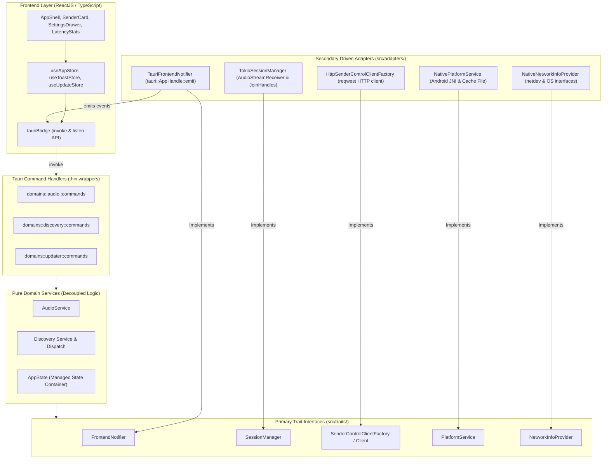
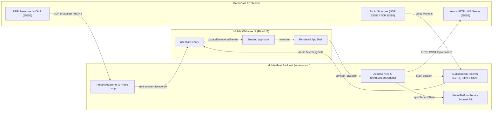
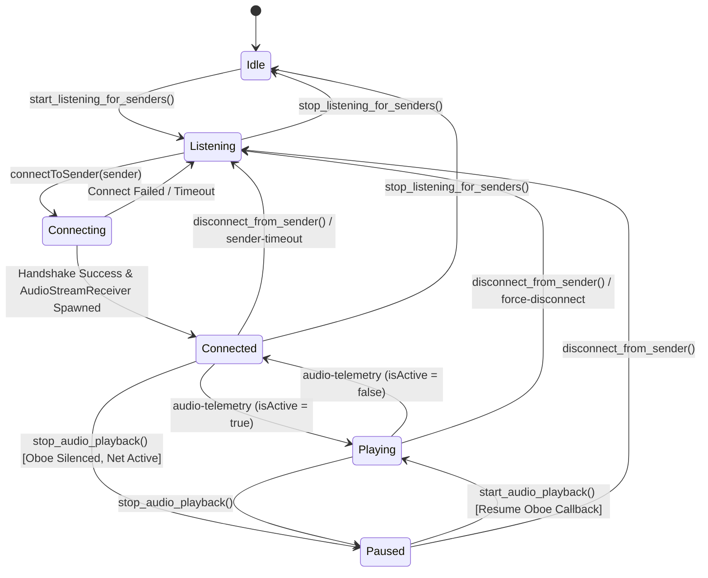
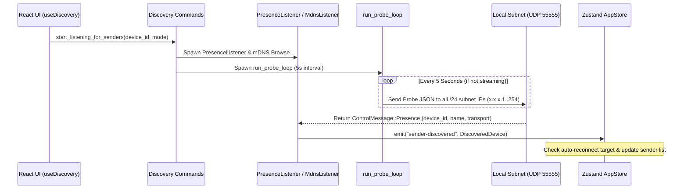
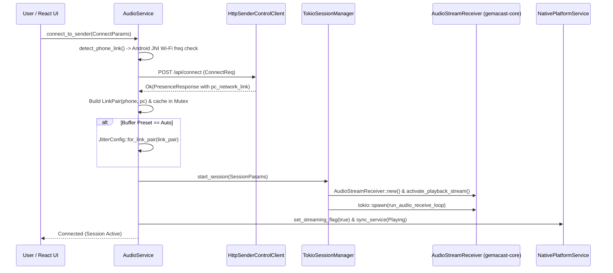
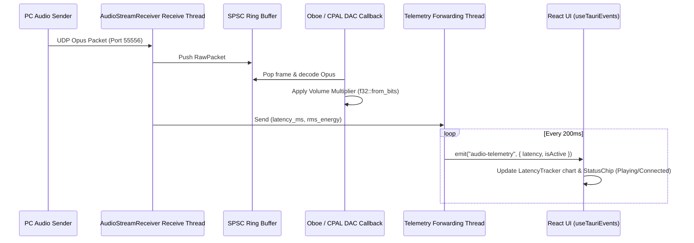
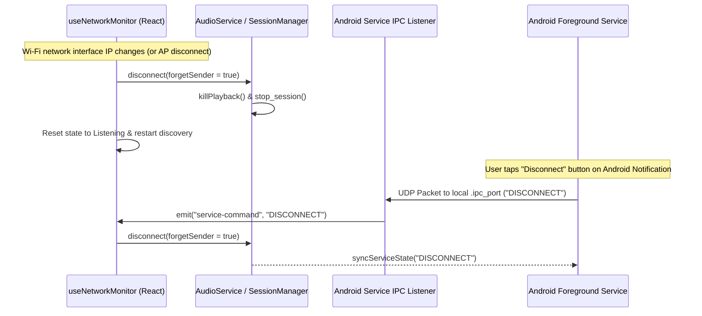
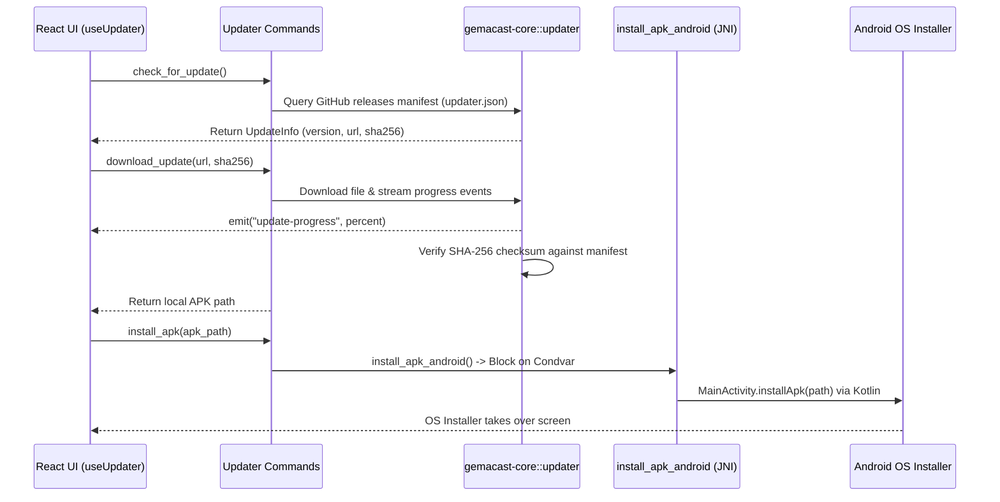

# Gemacast Mobile Blueprint

## Table of Contents
- [Tree Structure](#tree-structure) L41-L334
- [1. Crate Description Summary](#1-crate-description-summary) L338-L344
- [2. Crate Purposes](#2-crate-purposes) L346-L356
- [3. Design Patterns & Architecture Choices](#3-design-patterns--architecture-choices) L358-L390
  - [3.1 Hexagonal Architecture (Ports & Adapters)](#31-hexagonal-architecture-ports--adapters) L360-L364
  - [3.2 Dependency Injection via Tokio & Arc<dyn Trait>](#32-dependency-injection-via-tokio--arcdyn-trait) L366-L368
  - [3.3 Dynamic Network Link Quality Detection & Auto-Jitter Adaptivity](#33-dynamic-network-link-quality-detection--auto-jitter-adaptivity) L369-L371
  - [3.4 Android Native Interop & JNI Foreground Service Lifecycle](#34-android-native-interop--jni-foreground-service-lifecycle) L372-L376
  - [3.5 Hand-Written Mock Infrastructure for 100% Zero-I/O Unit Testing](#35-hand-written-mock-infrastructure-for-100-zero-io-unit-testing) L377-L379
  - [3.6 Cross-Layer Event-Driven Architecture (Tauri Emitter <-> Webview UI)](#36-cross-layer-event-driven-architecture-tauri-emitter---webview-ui) L380-L386
  - [3.7 SHA-256 Verified Auto-Updater & Native APK Installer](#37-sha-256-verified-auto-updater--native-apk-installer) L387-L389
- [4. Architecture Visualization](#4-architecture-visualization) L393-L510
  - [4.1 Mobile Hexagonal Architecture (Ports & Adapters)](#41-mobile-hexagonal-architecture-ports--adapters) L395-L446
  - [4.2 End-to-End System & Cross-Layer Communication Flow](#42-end-to-end-system--cross-layer-communication-flow) L448-L482
  - [4.3 Connection State & Session Lifecycle State Machine](#43-connection-state--session-lifecycle-state-machine) L484-L510
- [5. Crate Workflows](#5-crate-workflows) L513-L625
  - [Workflow 1: Automatic Sender Discovery & Dual-Stack Network Probe](#workflow-1-automatic-sender-discovery--dual-stack-network-probe) L515-L534
  - [Workflow 2: Connection Handshake & Network-Aware Session Initialization](#workflow-2-connection-handshake--network-aware-session-initialization) L536-L559
  - [Workflow 3: Real-Time Audio Streaming, Telemetry & Volume Control](#workflow-3-real-time-audio-streaming-telemetry--volume-control) L561-L580
  - [Workflow 4: Network Hopping & Foreground Service Synchronization](#workflow-4-network-hopping--foreground-service-synchronization) L581-L600
  - [Workflow 5: In-App Auto-Update & Native Android APK Installation](#workflow-5-in-app-auto-update--native-android-apk-installation) L601-L624
- [6. Detailed Module & File Explanations](#6-detailed-module--file-explanations) L627-L805
  - [6.1 Crate Root & Entry Points (/)](#61-crate-root--entry-points-) L629-L645
  - [6.2 Primary Trait Layer (src-tauri/src/traits/)](#62-primary-trait-layer-src-taurisrctraits) L648-L669
  - [6.3 Secondary Driven Adapters Layer (src-tauri/src/adapters/)](#63-secondary-driven-adapters-layer-src-taurisrcadapters) L672-L686
  - [6.4 Audio Domain Subsystem (src-tauri/src/domains/audio/)](#64-audio-domain-subsystem-src-taurisrcdomainsaudio) L689-L706
  - [6.5 Discovery Domain Subsystem (src-tauri/src/domains/discovery/)](#65-discovery-domain-subsystem-src-taurisrcdomainsdiscovery) L709-L731
  - [6.6 Android IPC Domain Subsystem (src-tauri/src/domains/ipc/)](#66-android-ipc-domain-subsystem-src-taurisrcdomainsipc) L734-L739
  - [6.7 Application Updater Domain Subsystem (src-tauri/src/domains/updater/)](#67-application-updater-domain-subsystem-src-taurisrcdomainsupdater) L742-L752
  - [6.8 React / TypeScript Frontend Core (src/core/)](#68-react--typescript-frontend-core-srccore) L755-L766
  - [6.9 React Custom Hooks & Event Bridge (src/hooks/)](#69-react-custom-hooks--event-bridge-srchooks) L769-L782
  - [6.10 Global State Management (src/stores/)](#610-global-state-management-srcstores) L785-L790
  - [6.11 Frontend User Interface Components (src/components/ & Root)](#611-frontend-user-interface-components-srccomponents--root) L793-L805
- [7. Summary Table of Units & Test Coverage](#7-summary-table-of-units--test-coverage) L808-L819

---

## Tree Structure
```bash
C:\Users\april\programming\my-projects\gemacast\gemacast-mobile    
├── ABOUT.md
├── bun.lock
├── bunfig.toml
├── eslint.config.js
├── index.html
├── package.json
├── README.md
├── src
|  ├── App.tsx
|  ├── assets
|  |  ├── tauri.svg
|  |  ├── typescript.svg
|  |  └── vite.svg
|  ├── components
|  |  ├── device
|  |  |  ├── DeviceInfo.test.tsx
|  |  |  ├── DeviceInfo.tsx
|  |  |  ├── StatusChip.test.tsx
|  |  |  └── StatusChip.tsx
|  |  ├── feedback
|  |  |  ├── Toast.test.tsx
|  |  |  ├── Toast.tsx
|  |  |  ├── ToastContainer.test.tsx
|  |  |  └── ToastContainer.tsx
|  |  ├── latency
|  |  |  ├── LatencyStats.test.tsx
|  |  |  ├── LatencyStats.tsx
|  |  |  └── NetworkLinkBadge.tsx
|  |  ├── layout
|  |  |  └── AppShell.tsx
|  |  ├── senders
|  |  |  ├── EmptyState.tsx
|  |  |  ├── ManualConnect.test.tsx
|  |  |  ├── ManualConnect.tsx
|  |  |  ├── ProcessSelect.test.tsx
|  |  |  ├── ProcessSelect.tsx
|  |  |  ├── SenderCard.test.tsx
|  |  |  ├── SenderCard.tsx
|  |  |  ├── SenderList.test.tsx
|  |  |  └── SenderList.tsx
|  |  ├── settings
|  |  |  ├── BitrateSelect.test.tsx
|  |  |  ├── BitrateSelect.tsx
|  |  |  ├── BufferPresetSelect.test.tsx
|  |  |  ├── BufferPresetSelect.tsx
|  |  |  ├── CustomJitterConfig.test.tsx
|  |  |  ├── CustomJitterConfig.tsx
|  |  |  ├── ExclusiveToggle.test.tsx
|  |  |  ├── ExclusiveToggle.tsx
|  |  |  ├── GainSlider.tsx
|  |  |  ├── KeepScreenOnToggle.tsx
|  |  |  ├── ModeSelector.test.tsx
|  |  |  ├── ModeSelector.tsx
|  |  |  ├── NoBufferWarning.tsx
|  |  |  ├── SettingsDrawer.test.tsx
|  |  |  ├── SettingsDrawer.tsx
|  |  |  ├── ThemeToggle.test.tsx
|  |  |  ├── ThemeToggle.tsx
|  |  |  └── UpdateBanner.tsx
|  |  └── shared
|  |     ├── ConfirmDialog.test.tsx
|  |     ├── ConfirmDialog.tsx
|  |     ├── CustomSelect.test.tsx
|  |     ├── CustomSelect.tsx
|  |     ├── HelpDialog.test.tsx
|  |     ├── HelpDialog.tsx
|  |     ├── SegmentedControl.tsx
|  |     └── Toggle.tsx
|  ├── core
|  |  ├── constants.ts
|  |  ├── error.test.ts
|  |  ├── error.ts
|  |  ├── help-content.ts
|  |  ├── latency-tracker.test.ts
|  |  ├── latency-tracker.ts
|  |  ├── persistence.test.ts
|  |  ├── persistence.ts
|  |  ├── presets.test.ts
|  |  ├── presets.ts
|  |  ├── tauri-bridge.test.ts
|  |  ├── tauri-bridge.ts
|  |  ├── types.ts
|  |  ├── validation.test.ts
|  |  └── validation.ts
|  ├── hooks
|  |  ├── use-audio.test.ts
|  |  ├── use-audio.ts
|  |  ├── use-connection.test.ts
|  |  ├── use-connection.ts
|  |  ├── use-custom-preset-editor.test.ts
|  |  ├── use-custom-preset-editor.ts
|  |  ├── use-discovery.test.ts
|  |  ├── use-discovery.ts
|  |  ├── use-drawer.ts
|  |  ├── use-manual-connect.ts
|  |  ├── use-network-monitor.ts
|  |  ├── use-settings.ts
|  |  ├── use-tauri-events.ts
|  |  ├── use-updater.ts
|  |  └── use-wake-lock.ts
|  ├── index.css
|  ├── main.tsx
|  ├── stores
|  |  ├── app-store.test.ts
|  |  ├── app-store.ts
|  |  ├── toast-store.test.ts
|  |  ├── toast-store.ts
|  |  └── update-store.ts
|  └── __tests__
|     ├── dom-setup.ts
|     └── setup.ts
├── src-tauri
|  ├── build.rs
|  ├── capabilities
|  |  └── default.json
|  ├── Cargo.toml
|  ├── gen
|  |  ├── android
|  |  |  ├── app
|  |  |  |  ├── build.gradle.kts
|  |  |  |  ├── proguard-rules.pro
|  |  |  |  ├── proguard-tauri.pro
|  |  |  |  ├── src
|  |  |  |  |  └── main
|  |  |  |  |     ├── AndroidManifest.xml
|  |  |  |  |     ├── assets
|  |  |  |  |     |  └── tauri.conf.json
|  |  |  |  |     ├── java
|  |  |  |  |     |  └── com
|  |  |  |  |     |     └── apir
|  |  |  |  |     |        └── gemacast
|  |  |  |  |     ├── jniLibs
|  |  |  |  |     |  ├── arm64-v8a
|  |  |  |  |     |  ├── armeabi-v7a
|  |  |  |  |     |  ├── x86
|  |  |  |  |     |  └── x86_64
|  |  |  |  |     └── res
|  |  |  |  |        ├── drawable
|  |  |  |  |        |  └── ic_launcher_background.xml
|  |  |  |  |        ├── drawable-v24
|  |  |  |  |        |  └── ic_launcher_foreground.xml
|  |  |  |  |        ├── layout
|  |  |  |  |        |  └── activity_main.xml
|  |  |  |  |        ├── mipmap-anydpi-v26
|  |  |  |  |        |  └── ic_launcher.xml
|  |  |  |  |        ├── mipmap-hdpi
|  |  |  |  |        |  ├── ic_launcher.png
|  |  |  |  |        |  ├── ic_launcher_foreground.png
|  |  |  |  |        |  └── ic_launcher_round.png
|  |  |  |  |        ├── mipmap-mdpi
|  |  |  |  |        |  ├── ic_launcher.png
|  |  |  |  |        |  ├── ic_launcher_foreground.png
|  |  |  |  |        |  └── ic_launcher_round.png
|  |  |  |  |        ├── mipmap-xhdpi
|  |  |  |  |        |  ├── ic_launcher.png
|  |  |  |  |        |  ├── ic_launcher_foreground.png
|  |  |  |  |        |  └── ic_launcher_round.png
|  |  |  |  |        ├── mipmap-xxhdpi
|  |  |  |  |        |  ├── ic_launcher.png
|  |  |  |  |        |  ├── ic_launcher_foreground.png
|  |  |  |  |        |  └── ic_launcher_round.png
|  |  |  |  |        ├── mipmap-xxxhdpi
|  |  |  |  |        |  ├── ic_launcher.png
|  |  |  |  |        |  ├── ic_launcher_foreground.png
|  |  |  |  |        |  └── ic_launcher_round.png
|  |  |  |  |        ├── values
|  |  |  |  |        |  ├── colors.xml
|  |  |  |  |        |  ├── ic_launcher_background.xml
|  |  |  |  |        |  ├── strings.xml
|  |  |  |  |        |  └── themes.xml
|  |  |  |  |        ├── values-night
|  |  |  |  |        |  └── themes.xml
|  |  |  |  |        └── xml
|  |  |  |  |           └── file_paths.xml
|  |  |  |  ├── tauri.build.gradle.kts
|  |  |  |  └── tauri.properties
|  |  |  ├── build.gradle.kts
|  |  |  ├── buildSrc
|  |  |  |  ├── build.gradle.kts
|  |  |  |  └── src
|  |  |  |     └── main
|  |  |  |        └── java
|  |  |  |           └── com
|  |  |  |              └── apir
|  |  |  |                 └── gemacast
|  |  |  ├── gradle
|  |  |  |  └── wrapper
|  |  |  |     ├── gradle-wrapper.jar
|  |  |  |     └── gradle-wrapper.properties
|  |  |  ├── gradle.properties
|  |  |  ├── gradlew
|  |  |  ├── gradlew.bat
|  |  |  ├── settings.gradle
|  |  |  └── tauri.settings.gradle
|  |  └── schemas
|  |     ├── acl-manifests.json
|  |     ├── android-schema.json
|  |     ├── capabilities.json
|  |     ├── desktop-schema.json
|  |     ├── mobile-schema.json
|  |     └── windows-schema.json
|  ├── src
|  |  ├── adapters
|  |  |  ├── frontend_notifier.rs
|  |  |  ├── network_info.rs
|  |  |  ├── platform_service.rs
|  |  |  ├── sender_control.rs
|  |  |  └── session_manager.rs
|  |  ├── adapters.rs
|  |  ├── domains
|  |  |  ├── audio
|  |  |  |  ├── commands.rs
|  |  |  |  ├── mod.rs
|  |  |  |  ├── playback.rs
|  |  |  |  └── service.rs
|  |  |  ├── discovery
|  |  |  |  ├── adb_session.rs
|  |  |  |  ├── commands.rs
|  |  |  |  ├── dispatch.rs
|  |  |  |  ├── heartbeat.rs
|  |  |  |  ├── listener.rs
|  |  |  |  ├── mod.rs
|  |  |  |  ├── native.rs
|  |  |  |  ├── probe.rs
|  |  |  |  └── service.rs
|  |  |  ├── ipc
|  |  |  |  ├── mod.rs
|  |  |  |  └── server.rs
|  |  |  ├── mod.rs
|  |  |  └── updater
|  |  |     ├── commands.rs
|  |  |     ├── install.rs
|  |  |     └── mod.rs
|  |  ├── lib.rs
|  |  ├── main.rs
|  |  ├── state.rs
|  |  ├── testing.rs
|  |  ├── traits
|  |  |  ├── frontend_notifier.rs
|  |  |  ├── network_info.rs
|  |  |  ├── platform_service.rs
|  |  |  ├── sender_control.rs
|  |  |  ├── session_manager.rs
|  |  |  └── types.rs
|  |  └── traits.rs
|  ├── tauri.conf.json
|  └── tauri.schema.json
├── tsconfig.json
└── vite.config.ts

directory: 2381 file: 18363 symboliclink: 5
```

---

## 1. Crate Description Summary

`gemacast-mobile` is the cross-platform mobile receiver application crate for **GemaCast** — a high-performance, low-latency audio relay application (similar to AudioRelay) built with Rust, Tauri v2, and ReactJS with TypeScript and Tailwind CSS.

`gemacast-mobile` embeds `gemacast-core` inside a modular, Hexagonal Architecture backend (`gemacast_mobile_lib`) to deliver real-time audio playback on Android and mobile platforms over Wi-Fi (UDP), USB Tethering, or ADB reverse TCP tunnels. The crate handles multi-protocol sender discovery (mDNS and UDP broadcast probing), HTTP/WebSocket control protocol client orchestration, Oboe/CPAL audio output stream management with WebRTC NetEQ-inspired adaptive jitter buffering, Android JNI foreground service lifecycle synchronization, link-aware network quality classification, and SHA-256 verified in-app auto-updating with native APK installation.

---

## 2. Crate Purposes

1. **Low-Latency Wireless & Wired Audio Receiver**: Receive Opus-encoded or raw PCM audio streams from GemaCast PC senders over Wi-Fi (UDP), USB Tethering, or ADB reverse TCP tunnels with imperceptible latency (<20ms on USB/ADB, ~30–60ms on Wi-Fi).
2. **Hexagonal & Decoupled Backend Architecture**: Enforce strict separation between domain logic and external systems using Rust trait boundaries (`FrontendNotifier`, `SessionManager`, `SenderControlClient`, `PlatformService`, `NetworkInfoProvider`), enabling 100% of domain and control logic to be unit tested without Tauri runtime or Android environment dependencies.
3. **Link-Aware Adaptive Jitter Management**: Classify physical connection pairs (`LinkPair`) between mobile and sender nodes (e.g. 5GHz Wi-Fi, 2.4GHz Wi-Fi, ADB, USB Tether) and automatically configure NetEQ jitter buffer profiles tailored to network jitter characteristics.
4. **Android Native Integration & Service Synchronization**: Maintain uninterrupted background playback by synchronizing the Android Foreground Service (`syncServiceState()`), keeping Wi-Fi power-save modes from dropping packets, and performing JNI Wi-Fi frequency inspection (`getTransportType()`).
5. **Real-Time Web UI & Cross-Layer Bridge**: Power a modern React frontend with live latency telemetry charts, process-specific audio capture selector, bitrate controls, custom jitter config editors, and hardware back-button exit handling.
6. **In-App Auto-Updater & Native Installer**: Query GitHub release manifests, download APK updates with progress reporting and mandatory SHA-256 checksum verification, and invoke the Android system installer via Kotlin/JNI `installApk()`.

---

## 3. Design Patterns & Architecture Choices

### 3.1 Hexagonal Architecture (Ports & Adapters)
`gemacast-mobile` strictly implements **Hexagonal Architecture**:
- **Primary Trait Layer (`src-tauri/src/traits/`)**: Core contracts defining I/O boundaries (`FrontendNotifier`, `SessionManager`, `SenderControlClient`, `PlatformService`, `NetworkInfoProvider`). Domain logic depends exclusively on these traits.
- **Secondary Driven Adapters (`src-tauri/src/adapters/`)**: Concrete production implementations (`TauriFrontendNotifier`, `TokioSessionManager`, `HttpSenderControlClientFactory`, `NativePlatformService`, `NativeNetworkInfoProvider`).
- **Composition Root (`src-tauri/src/lib.rs`)**: Instantiates adapters once at startup, wraps them in `Arc<dyn Trait>`, and injects them into domain services and managed state (`AppState`).

### 3.2 Dependency Injection via Tokio & Arc<dyn Trait>
All services (such as `AudioService`) are defined as plain Rust structs holding trait objects (`Arc<dyn Trait>`). This eliminates global mutable state, makes async call chains deterministic, and allows unit tests in `testing.rs` to substitute real sockets and Android JNI calls with zero-I/O mock implementations (`MockSessionManager`, `MockSenderControlClient`, `MockPlatformService`).

### 3.3 Dynamic Network Link Quality Detection & Auto-Jitter Adaptivity
During the HTTP connect handshake (`connect_to_sender`), the mobile app detects its local link type (via Android JNI Wi-Fi frequency parsing, e.g. 5180MHz = 5GHz Wi-Fi, 2412MHz = 2.4GHz Wi-Fi) and receives the PC's link type. It constructs a `LinkPair` and computes an `effective_link()`. If the user selects the "Auto" buffer preset, `JitterConfig::for_link_pair(link_pair)` automatically tunes minimum buffer depth, comfort caps, and decay half-lives. Furthermore, `AudioService` caches the `LinkPair` so toggling buffer presets mid-session (Auto → Balanced → Auto) restores the link-optimised configuration.

### 3.4 Android Native Interop & JNI Foreground Service Lifecycle
Android execution requires background privilege management. `NativePlatformService` communicates with `MainActivity` over JNI:
- `call_native_sync_service()`: Sends `"START"`, `"STOP_STREAM"`, or `"DISCONNECT"` to update the Android Foreground Service status notification.
- `call_native_transport_check()`: Calls `getTransportType()` on the Activity to query active Android network transports and ADB status strings (e.g. `"WIFI:5180|ADB_ON"`).
- `install_apk_android()`: Invokes Kotlin `installApk(path)` using a `Condvar` lock to wait for execution on the WebView thread without encountering boot classloader `NoClassDefFoundError` issues for `FileProvider`.

### 3.5 Hand-Written Mock Infrastructure for 100% Zero-I/O Unit Testing
`src-tauri/src/testing.rs` contains hand-written mock implementations (`MockFrontendNotifier`, `MockSessionManager`, `MockSenderControlClient`, `MockPlatformService`, `MockNetworkInfoProvider`). Every mock records call histories in thread-safe `Mutex<Vec<Call>>` buffers, allowing tests to verify exact invocation order, parameters, and error propagation without opening sockets, spawning real audio devices, or calling Android JNI.

### 3.6 Cross-Layer Event-Driven Architecture (Tauri Emitter <-> Webview UI)
Communication between the Rust backend and React frontend relies on strongly-typed Tauri events:
- `sender-discovered` & `sender-timeout`: Pushed during mDNS and UDP broadcast discovery.
- `audio-telemetry`: Emitted at 5Hz carrying real-time latency (ms) and RMS audio energy.
- `playback-error` & `ws-error`: Dispatched on stream or WebSocket failures.
- `service-command`: Receives local UDP loopback IPC commands from the Android service notification buttons (`"DISCONNECT"`, `"STOP_STREAM"`, `"RESUME"`) and forwards them to the frontend state machine without race conditions.

### 3.7 SHA-256 Verified Auto-Updater & Native APK Installer
The auto-updater in `domains/updater/` queries GitHub release manifests via `gemacast-core::updater`. When downloading an update APK, progress events (`update-progress`) are streamed to the React UI. If a SHA-256 digest is specified in the manifest, the file is validated before returning the local path. `install_apk` then delegates to Kotlin `MainActivity.installApk(path)` to launch the Android package installer Intent.

---

## 4. Architecture Visualization

### 4.1 Mobile Hexagonal Architecture (Ports & Adapters)



### 4.2 End-to-End System & Cross-Layer Communication Flow



### 4.3 Connection State & Session Lifecycle State Machine



---

## 5. Crate Workflows

### Workflow 1: Automatic Sender Discovery & Dual-Stack Network Probe


### Workflow 2: Connection Handshake & Network-Aware Session Initialization


### Workflow 3: Real-Time Audio Streaming, Telemetry & Volume Control


### Workflow 4: Network Hopping & Foreground Service Synchronization


### Workflow 5: In-App Auto-Update & Native Android APK Installation


---

## 6. Detailed Module & File Explanations

### 6.1 Crate Root & Entry Points (`/`)
- `src-tauri/Cargo.toml`: Cargo package manifest for `gemacast-mobile`. Configures `gemacast_mobile_lib` library targets (`staticlib`, `cdylib`, `rlib`), dependencies (`tauri`, `gemacast-core`, `tokio`, `netdev`, `tracing`, `reqwest`, `tauri-plugin-device-info`, `tauri-plugin-log`, `jni`), and workspace settings.
- `src-tauri/src/main.rs`: Executable entry point. Prevents additional console windows on Windows release builds (`#![cfg_attr(not(debug_assertions), windows_subsystem = "windows")]`) and invokes `gemacast_mobile_lib::run()`.
- `src-tauri/src/lib.rs`: Core composition root of the mobile crate:
  - Configures `tauri_plugin_log` to bridge `tracing::*` events to `logcat` on Android and to persistent log files.
  - Instantiates production adapters (`TauriFrontendNotifier`, `TokioSessionManager`, `HttpSenderControlClientFactory`, `NativePlatformService`, `NativeNetworkInfoProvider`).
  - Constructs `AudioService` with injected trait implementations.
  - Registers managed state (`AppState`) and spawns the background Android IPC service command listener (`run_service_command_listener`).
  - Registers all 21 Tauri command handlers in `generate_handler![]` and configures graceful exit handling on `RunEvent::ExitRequested`.
- `src-tauri/src/state.rs`: Managed state container (`AppState`) passed to Tauri commands via `State<'_, AppState>`. Holds `Arc<AudioService>`, `Arc<dyn FrontendNotifier>`, `Arc<dyn NetworkInfoProvider>`, `Arc<dyn PlatformService>`, `Mutex<Option<JoinHandle<()>>>` for the active discovery task, and a shared `is_streaming` atomic flag.
- `src-tauri/src/testing.rs`: Hand-written mock infrastructure for zero-I/O unit testing:
  - `MockFrontendNotifier`: Captures `FrontendEvent` variants (`SenderDiscovered`, `SenderTimeout`, `ForceDisconnect`, `AudioTelemetry`, etc.) in a `Mutex<Vec>`.
  - `MockSessionManager`: Records `SessionCall` variants (`StartSession`, `StopSession`, `PausePlayback`, `ResumePlayback`, `UpdateJitterConfig`, `UpdateBitrate`, etc.).
  - `MockSenderControlClient` & `MockSenderControlClientFactory`: Records `ControlClientCall` variants (`Connect`, `Disconnect`, `GetAudioSources`, `Probe`, `ChangeSource`, `ChangeBitrate`, `GetProcessList`).
  - `MockPlatformService`: Records `PlatformCall` variants (`GetTransportType`, `SyncService`, `SetStreamingFlag`).
  - `MockNetworkInfoProvider`: Returns configurable `InterfaceInfo` and local IP addresses for test assertions.

---

## 6.2 Primary Trait Layer (`src-tauri/src/traits/`)
Core trait contracts enforcing Hexagonal Architecture decoupling across all I/O boundaries.
- `src-tauri/src/traits.rs`: Re-exports all trait definitions and parameter types.
- `src-tauri/src/traits/types.rs`:
  - `SessionParams`: Parameters required to initialize a playback session (`jitter_config`, `is_tcp`, `exclusive_mode`, `target_ip`, `mode`, `device_id`, `bitrate`, `network_link`).
  - `SessionInfo`: Snapshot of an active session's metadata.
  - `InterfaceInfo`: Simplified network interface details (`name`, `mac_addr`, `ipv4`, `ipv6`, `is_wifi`, `is_usb`).
  - `ConnectParams`: Parameters for establishing a sender connection (`ip`, `device_id`, `device_name`, `mode`, `exclusive_mode`, `jitter_config`, `bitrate`, `phone_network_link`).
  - `ResumeParams`: Parameters for resuming playback.
- `src-tauri/src/traits/frontend_notifier.rs`:
  - `FrontendNotifier`: Trait declaring frontend notification methods (`emit_sender_discovered`, `emit_sender_timeout`, `emit_force_disconnect`, `emit_sender_connected`, `emit_audio_telemetry`, `emit_playback_error`, `emit_ws_disconnect`, `emit_ws_error`, `emit_service_command`).
- `src-tauri/src/traits/network_info.rs`:
  - `NetworkInfoProvider`: Trait declaring methods to query local IP, default interface, and network interface lists.
- `src-tauri/src/traits/platform_service.rs`:
  - `PlaybackState`: Enum (`Playing`, `Paused`, `Stopped`).
  - `PlatformService`: Trait declaring methods for Android JNI transport checking (`get_transport_type`), foreground service synchronization (`sync_service`), and streaming active flag file management (`set_streaming_flag`).
- `src-tauri/src/traits/sender_control.rs`:
  - `SenderControlClient`: Async trait declaring HTTP RPC methods to PC senders (`connect`, `disconnect`, `get_audio_sources`, `probe`, `change_source`, `change_bitrate`, `get_process_list`).
  - `SenderControlClientFactory`: Trait instantiating `SenderControlClient` objects per target IP.
- `src-tauri/src/traits/session_manager.rs`:
  - `SessionManager`: Async trait controlling audio playback session lifecycle (`start_session`, `stop_session`, `set_playing`, `pause_playback`, `resume_playback`, `update_jitter_config`, `session_info`, `update_bitrate`, `set_volume`, `start_ws_client`, `stop_ws_client`).

---

## 6.3 Secondary Driven Adapters Layer (`src-tauri/src/adapters/`)
Concrete production implementations of primary ports layer traits.
- `src-tauri/src/adapters.rs`: Re-exports all production adapters.
- `src-tauri/src/adapters/frontend_notifier.rs`:
  - `TauriFrontendNotifier`: Implements `FrontendNotifier` by calling `tauri::AppHandle::emit()` to push JSON events to the webview frontend.
- `src-tauri/src/adapters/network_info.rs`:
  - `NativeNetworkInfoProvider`: Implements `NetworkInfoProvider` using `netdev` and `gemacast_core::network` to query OS network interfaces and classify Wi-Fi vs USB links.
- `src-tauri/src/adapters/platform_service.rs`:
  - `NativePlatformService`: Implements `PlatformService`. Invokes Android JNI helpers on `target_os = "android"` (`call_native_transport_check`, `call_native_sync_service`) and writes/removes `.streaming_active` flag files in the app cache directory.
- `src-tauri/src/adapters/sender_control.rs`:
  - `HttpSenderControlClient`: Wraps `gemacast_core::control::HttpControlClient` to issue reqwest REST HTTP requests to PC senders.
  - `HttpSenderControlClientFactory`: Production factory instantiating `HttpSenderControlClient`.
- `src-tauri/src/adapters/session_manager.rs`:
  - `TokioSessionManager`: Manages active `ActiveSession` state and WebSocket client `JoinHandle`s using Tokio mutexes and oneshot channels. Handles graceful teardown timeouts (1500ms), stream pausing/resuming, atomic volume updates, and jitter configuration updates.

---

## 6.4 Audio Domain Subsystem (`src-tauri/src/domains/audio/`)
Pure domain service and command handlers managing audio streaming lifecycle, control RPCs, and playback streams.
- `src-tauri/src/domains/audio/mod.rs`: Re-exports audio commands, playback, and service modules.
- `src-tauri/src/domains/audio/commands.rs`:
  - Thin `#[tauri::command]` handlers forwarding calls to `AudioService`: `connect_to_sender`, `disconnect_from_sender`, `start_audio_playback`, `stop_audio_playback`, `notify_streaming_stopped`, `kill_playback`, `update_jitter_config`, `get_audio_sources`, `change_audio_source`, `change_audio_bitrate`, `get_process_list`, `establish_websocket`, `probe_sender`, `set_audio_gain`, `get_network_link_pair`.
- `src-tauri/src/domains/audio/playback.rs`:
  - `setup_event_forwarding()`: Spawns background tasks forwarding connected IP events and 5Hz latency/RMS telemetry updates to `FrontendNotifier`.
  - `spawn_session_receiver()`: Instantiates `gemacast_core::stream::receiver::AudioStreamReceiver`, configures atomic controls (`is_playing`, `volume`, `is_tcp_mode`), activates DAC playback, and spawns the receive loop task.
- `src-tauri/src/domains/audio/service.rs`:
  - `AudioService`: Central audio domain coordinator struct.
  - `connect_to_sender()`: Performs HTTP handshake, computes and caches `LinkPair`, applies network-aware Auto jitter config overrides, starts session receiver, and syncs Android service state.
  - `disconnect_from_sender()`: Sends HTTP disconnect, stops session receiver, clears cached link pair, and syncs Android service state to Stopped.
  - `start_audio_playback()` & `stop_audio_playback()`: Resumes or pauses Oboe audio output without tearing down the network session or HTTP connection.
  - `kill_playback()`: Emergency teardown clearing streaming flags and sessions.
  - `update_jitter_config()`: Updates active session jitter config; re-applies network-aware link pair override if user toggles back to Auto sentinel mid-session.
  - `establish_websocket()`: Connects WebSocket control stream to monitor PC disconnect/error events.
  - Includes a comprehensive unit test suite (`tests`) verifying connect, disconnect, pause/resume, kill, bitrate updates, and link pair cache behavior using `MockSessionManager` and `MockSenderControlClient`.

---

## 6.5 Discovery Domain Subsystem (`src-tauri/src/domains/discovery/`)
Multi-protocol device discovery, UDP broadcast probing, heartbeat eviction, and Android JNI transport classification.
- `src-tauri/src/domains/discovery/mod.rs`: Re-exports discovery submodules.
- `src-tauri/src/domains/discovery/commands.rs`:
  - Thin `#[tauri::command]` handlers: `get_local_ip`, `get_network_identifier`, `start_listening_for_senders`, `stop_listening_for_senders`, `get_connection_status`, `get_network_state`.
- `src-tauri/src/domains/discovery/adb_session.rs`:
  - `run_adb_session()`: Background task connecting to local ADB discovery TCP server (Port 55558). Sends probe requests and streams newline-delimited presence messages for USB streaming. Emits force disconnect on connection loss.
- `src-tauri/src/domains/discovery/dispatch.rs`:
  - `DispatchContext`: Tracks `sender_last_seen` timestamps and `active_usb_senders`. Filters discovered presence messages based on active `ConnectionMode` (Wi-Fi, USB, ADB) and suppresses Wi-Fi presence entries when USB tethering is active. Includes unit tests for mode filtering and loopback isolation.
- `src-tauri/src/domains/discovery/heartbeat.rs`:
  - `evict_stale_senders()`: Extracted watchdog logic checking `sender_last_seen` timestamps. Emits `emit_sender_timeout` for senders silent for >30 seconds and purges them from memory. Includes unit tests for single and multiple eviction scenarios.
- `src-tauri/src/domains/discovery/listener.rs`:
  - `spawn_discovery_listener()`: Spawns the main discovery orchestrator task running `PresenceListener`, mDNS browse, heartbeat watchdog tick, subnet probe loop, and ADB session handler.
- `src-tauri/src/domains/discovery/native.rs`:
  - `call_native_transport_check()`: Calls Android `MainActivity.getTransportType()` via JNI to receive active transport strings (`"WIFI:5180|ADB_ON"`).
  - `call_native_sync_service()`: Calls Android `MainActivity.syncServiceState(action, is_exclusive)` via JNI.
- `src-tauri/src/domains/discovery/probe.rs`:
  - `run_probe_loop()`: Periodic task (every 5 seconds) sweeping all non-loopback /24 local subnets (x.x.x.1..254) with UDP probe packets. Skips scans while `is_streaming` is active to prevent packet bursts on 2.4GHz Wi-Fi channels.
- `src-tauri/src/domains/discovery/service.rs`:
  - `get_local_ip()` & `get_network_identifier()`: Formats local IP and network IDs (`"{iface}_{mac}_{ip}"`).
  - `get_connection_status()`: Enriches platform transport status with local network interface capabilities.
  - `detect_phone_link()`: Classifies phone connection link quality (`Adb`, `UsbTether`, `Wifi5Ghz`, `Wifi2_4Ghz`, `WifiUnknown`, `Unknown`) by parsing Android JNI Wi-Fi frequencies (e.g., >=4000MHz = 5GHz). Includes full unit tests for transport string parsing and link detection.

---

## 6.6 Android IPC Domain Subsystem (`src-tauri/src/domains/ipc/`)
Local UDP loopback IPC server receiving control actions from Android notification buttons.
- `src-tauri/src/domains/ipc/mod.rs`: Re-exports IPC server module.
- `src-tauri/src/domains/ipc/server.rs`:
  - `run_service_command_listener()`: Binds a local UDP socket on `127.0.0.1:0`, writes the assigned port to `.ipc_port` in the app cache directory, and listens for command strings (`"DISCONNECT"`, `"STOP_STREAM"`, `"RESUME"`) sent by the Android Kotlin service. Emits `service-command` events to the React frontend to execute state transitions safely without double-teardown race conditions.

---

## 6.7 Application Updater Domain Subsystem (`src-tauri/src/domains/updater/`)
Auto-update checking, background downloading, SHA-256 checksum validation, and Android APK installation.
- `src-tauri/src/domains/updater/mod.rs`: Re-exports updater commands and installation modules.
- `src-tauri/src/domains/updater/commands.rs`:
  - `check_for_update()`: Checks GitHub release manifests via `gemacast_core::updater`.
  - `download_update()`: Downloads update APK to cache directory, streams progress percentages to `update-progress` events, and verifies SHA-256 checksum.
  - `cleanup_stale_updates()`: Purges leftover update binaries.
  - `install_apk()`: Triggers `install_apk_android` on Android platforms.
- `src-tauri/src/domains/updater/install.rs`:
  - `install_apk_android()`: Android JNI bridge calling Kotlin `MainActivity.installApk(path)`. Uses a `Condvar` to block synchronously on the calling thread until the WebView thread completes execution, avoiding boot classloader `NoClassDefFoundError` issues with `FileProvider`.

---

## 6.8 React / TypeScript Frontend Core (`src/core/`)
TypeScript types, constants, error hierarchies, preset definitions, and Tauri bridge wrappers.
- `src/core/constants.ts`: Application constants.
- `src/core/error.ts` & `error.test.ts`: `ErrorCode` enum and `GemaCastError` class with static factory methods (`failedToStartDiscovery`, `playbackError`, `senderTimeout`, etc.) and user-friendly error message mappings. Includes unit tests for error creation.
- `src/core/help-content.ts`: Educational help content text for UI modal dialogs.
- `src/core/latency-tracker.ts` & `latency-tracker.test.ts`: Rolling 50-sample window tracker computing `current`, `avg`, `max`, and `min` latency metrics. Includes unit tests for window rolling and statistical calculations.
- `src/core/persistence.ts` & `persistence.test.ts`: `localStorage` persistence layer for application settings (`loadSettings`, `saveSettings`), last connected sender (`loadLastSender`, `saveLastSender`), and device UUID generation (`getOrCreateDeviceId`). Includes unit tests for storage fallback and settings loading.
- `src/core/presets.ts` & `presets.test.ts`: Jitter buffer preset definitions (`auto`, `wired`, `fast`, `balanced`, `stable`, `resilient`, `custom`, `nobuffer`). Includes `getPresetConfig()` resolution helper and unit tests for preset lookups.
- `src/core/tauri-bridge.ts` & `tauri-bridge.test.ts`: Strongly-typed TypeScript wrapper around Tauri's `invoke()` API for all 21 backend commands. Includes helper `resolveBitrate()` and unit tests for bitrate resolution logic.
- `src/core/types.ts`: Core TypeScript interface and enum definitions (`Status`, `ConnectionMode`, `ConnectionHealth`, `DiscoveredSender`, `JitterConfig`, `NetworkLinkPairInfo`, `AudioSource`, `AppSettings`, `AppState`, `Result`).
- `src/core/validation.ts` & `validation.test.ts`: Input validation helpers for IP addresses, ports, and custom jitter buffer numerical fields. Includes unit tests for edge-case validation.

---

## 6.9 React Custom Hooks & Event Bridge (`src/hooks/`)
Custom React hooks connecting UI components to global Zustand stores and Tauri event streams.
- `src/hooks/use-audio.ts` & `use-audio.test.ts`: Controls playback states (`startPlayback`, `stopPlayback`, `updateAudioActive`). Manages transitions between `Playing`, `Connected`, and `Paused` without tearing down network sessions. Includes unit tests.
- `src/hooks/use-connection.ts` & `use-connection.test.ts`: Manages sender connection lifecycle (`connectToSender`, `disconnect`, `handleSenderTimeout`, `handleForceDisconnect`, `changeAudioSource`). Performs retries, establishes WebSockets, fetches audio sources and process lists, and queries network link pairs. Includes unit tests.
- `src/hooks/use-custom-preset-editor.ts` & `use-custom-preset-editor.test.ts`: Form state hook for creating and editing custom jitter buffer configurations. Includes unit tests.
- `src/hooks/use-discovery.ts` & `use-discovery.test.ts`: Drives backend discovery (`startListening`, `stopListening`). Includes unit tests.
- `src/hooks/use-drawer.ts`: Controls settings drawer visibility state.
- `src/hooks/use-manual-connect.ts`: Form hook for manually connecting to a PC sender by IP address.
- `src/hooks/use-network-monitor.ts`: Background network monitor polling `getNetworkState()` every 3 seconds. Detects network interface hops (e.g. Wi-Fi network switch), triggers clean disconnects, and manages online/offline browser events.
- `src/hooks/use-settings.ts`: Wrapper hook for updating application settings.
- `src/hooks/use-tauri-events.ts`: Global listener binding Tauri events (`audio-telemetry`, `playback-error`, `sender-discovered`, `sender-timeout`, `force-disconnect`, `ws-disconnect`, `ws-error`, `service-command`) to Zustand store actions.
- `src/hooks/use-updater.ts`: Drives auto-updater lifecycle (checking for updates on mount, listening to `update-progress`, triggering downloads and installations).
- `src/hooks/use-wake-lock.ts`: Web Screen Wake Lock API wrapper preventing screen sleep during streaming when `keepScreenOn` is enabled.

---

## 6.10 Global State Management (`src/stores/`)
Zustand global stores managing client state, toasts, and updater status.
- `src/stores/app-store.ts` & `app-store.test.ts`: Main application state store (`AppState` & `AppActions`). Manages device info, connection status, discovered sender lists, latency stats, settings, audio sources, process lists, and network link pairs. Includes unit tests for state updates.
- `src/stores/toast-store.ts` & `toast-store.test.ts`: Notification toast queue store supporting `info`, `success`, `warning`, and non-auto-dismissing `error` toasts with expandable full log views. Includes unit tests.
- `src/stores/update-store.ts`: Global state store for the auto-updater (`idle`, `checking`, `available`, `downloading`, `ready`, `installing`, `error`, `up-to-date`). Preserves update state across component unmounts and app resumes.

---

## 6.11 Frontend User Interface Components (`src/components/` & Root)
Modular React UI components styled with Tailwind CSS.
- `src/App.tsx`: Main React component. Initializes device info, local IP, and connection modes on mount; binds hardware back-button double-press exit handler; renders `AppShell`.
- `src/main.tsx`: React entry point rendering `<App />` inside React strict mode.
- `src/index.css`: Global Tailwind CSS rules, dark/light theme CSS variables, dynamic animations, and glassmorphism styling.
- `src/components/device/`: `DeviceInfo.tsx` & `DeviceInfo.test.tsx` (displays device name, local IP, and mode badge), `StatusChip.tsx` & `StatusChip.test.tsx` (visual connection status indicator).
- `src/components/feedback/`: `Toast.tsx` & `Toast.test.tsx`, `ToastContainer.tsx` & `ToastContainer.test.tsx` (floating toast notification overlay).
- `src/components/latency/`: `LatencyStats.tsx` & `LatencyStats.test.tsx` (real-time latency stats display & rolling history chart), `NetworkLinkBadge.tsx` (renders phone/PC network link quality badges, e.g. "WiFi 5 GHz").
- `src/components/layout/`: `AppShell.tsx` (main application layout containing header, sender list, latency card, bottom control bar, and settings drawer).
- `src/components/senders/`: `SenderCard.tsx` & `SenderCard.test.tsx` (sender list item with connect/disconnect actions), `SenderList.tsx` & `SenderList.test.tsx` (list container with auto-reconnect banner), `EmptyState.tsx`, `ManualConnect.tsx` & `ManualConnect.test.tsx`, `ProcessSelect.tsx` & `ProcessSelect.test.tsx` (modal for selecting single-process audio capture).
- `src/components/settings/`: `SettingsDrawer.tsx` & `SettingsDrawer.test.tsx` (slide-out settings panel), `BufferPresetSelect.tsx` & `BufferPresetSelect.test.tsx`, `CustomJitterConfig.tsx` & `CustomJitterConfig.test.tsx`, `BitrateSelect.tsx` & `BitrateSelect.test.tsx`, `ExclusiveToggle.tsx` & `ExclusiveToggle.test.tsx`, `GainSlider.tsx` (volume multiplier slider -24dB to +12dB), `ModeSelector.tsx` & `ModeSelector.test.tsx` (Wi-Fi / USB / ADB mode toggle), `KeepScreenOnToggle.tsx`, `ThemeToggle.tsx` & `ThemeToggle.test.tsx`, `UpdateBanner.tsx`, `NoBufferWarning.tsx`.
- `src/components/shared/`: `ConfirmDialog.tsx` & `ConfirmDialog.test.tsx`, `CustomSelect.tsx` & `CustomSelect.test.tsx`, `HelpDialog.tsx` & `HelpDialog.test.tsx`, `SegmentedControl.tsx`, `Toggle.tsx`.

---

## 7. Summary Table of Units & Test Coverage

| Module / Component | Core Responsibility | Unit & Integration Test Files |
| :--- | :--- | :--- |
| **`traits` & `adapters`** | Ports & Adapters interfaces and production I/O adapters | Verified via zero-I/O mock suite in `testing.rs` |
| **`domains::audio`** | Audio session lifecycle, playback streams, link-pair auto jitter | `domains::audio::service::tests` (Connect, disconnect, pause, resume, bitrate, link pair cache) |
| **`domains::discovery`** | mDNS, presence listener, heartbeat eviction, probe loop, JNI link check | `discovery::dispatch::tests`, `discovery::heartbeat::tests`, `discovery::service::tests` (Mode filtering, eviction, link detection) |
| **`domains::ipc`** | Android notification UDP IPC service listener | `domains::ipc::server` (Loopback UDP command emission) |
| **`domains::updater`** | GitHub release manifest query, SHA-256 download, JNI installer | `domains::updater::commands`, `domains::updater::install` |
| **`core` (TS)** | Types, error hierarchy, latency tracking, presets, persistence, bridge | `error.test.ts`, `latency-tracker.test.ts`, `persistence.test.ts`, `presets.test.ts`, `tauri-bridge.test.ts`, `validation.test.ts` |
| **`hooks` (TS)** | Connection state machine, audio controls, discovery, network monitor | `use-audio.test.ts`, `use-connection.test.ts`, `use-custom-preset-editor.test.ts`, `use-discovery.test.ts` |
| **`stores` (TS)** | Global Zustand stores (AppStore, ToastStore, UpdateStore) | `app-store.test.ts`, `toast-store.test.ts` |
| **`components` (React)** | UI elements, dialogs, settings controls, latency cards | `DeviceInfo.test.tsx`, `StatusChip.test.tsx`, `Toast.test.tsx`, `ToastContainer.test.tsx`, `LatencyStats.test.tsx`, `SenderCard.test.tsx`, `SenderList.test.tsx`, `ManualConnect.test.tsx`, `ProcessSelect.test.tsx`, `SettingsDrawer.test.tsx`, `BufferPresetSelect.test.tsx`, `BitrateSelect.test.tsx`, `CustomJitterConfig.test.tsx`, `ExclusiveToggle.test.tsx`, `ModeSelector.test.tsx`, `ThemeToggle.test.tsx`, `ConfirmDialog.test.tsx`, `CustomSelect.test.tsx`, `HelpDialog.test.tsx` |