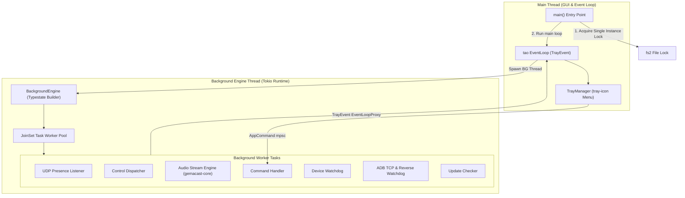
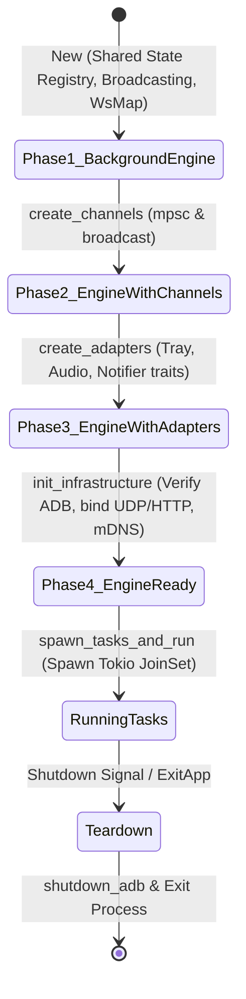
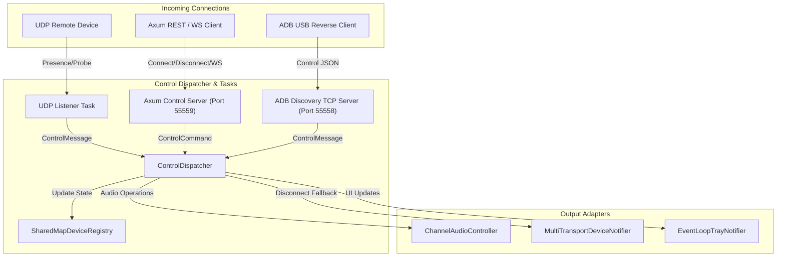
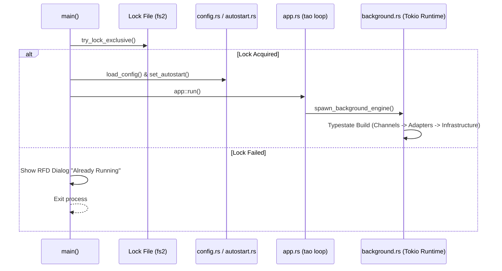
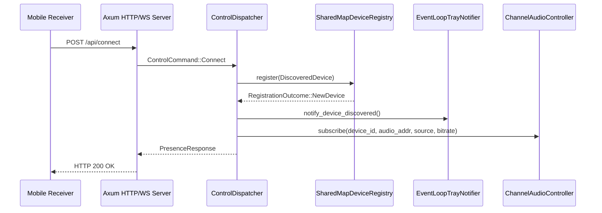
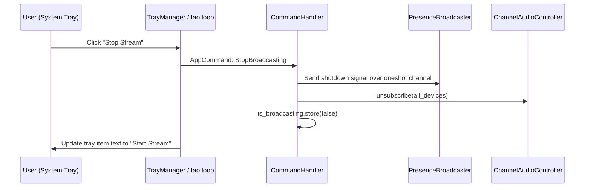
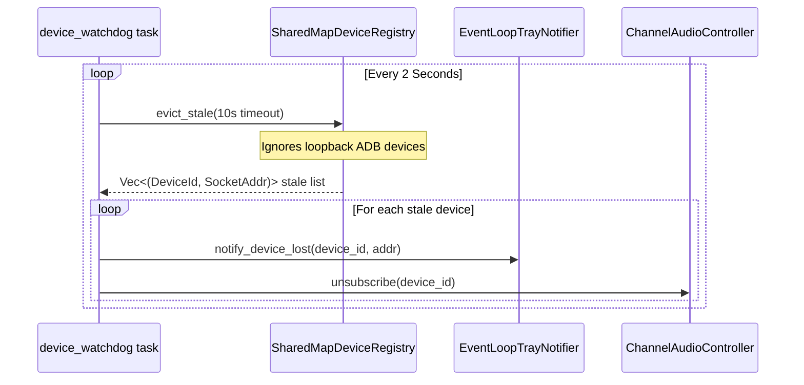
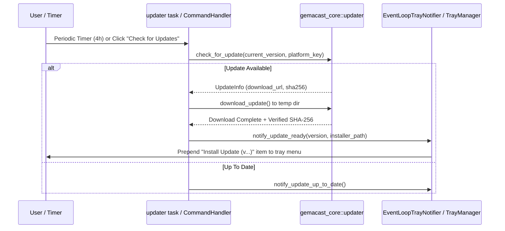

# Gemacast PC Blueprint

## Table of Contents
- [Tree Structure](#tree-structure) L39-L79
- [1. Crate Description Summary](#1-crate-description-summary) L83-L89
- [2. Crate Purposes](#2-crate-purposes) L91-L100
- [3. Design Patterns & Architecture Choices](#3-design-patterns--architecture-choices) L102-L146
  - [3.1 Typestate Builder & Thread-Separated Architecture](#31-typestate-builder--thread-separated-architecture) L104-L112
  - [3.2 Decoupled Traits & Port Adapters Architecture](#32-decoupled-traits--port-adapters-architecture) L114-L121
  - [3.3 Event-Driven Asynchronous Message Pipelines](#33-event-driven-asynchronous-message-pipelines) L123-L126
  - [3.4 Multi-Transport Device Notification Fallback Stack](#34-multi-transport-device-notification-fallback-stack) L128-L132
  - [3.5 Native Single-Instance File Locking & Robust Autostart](#35-native-single-instance-file-locking--robust-autostart) L134-L136
  - [3.6 Automated ADB Bundling & Teardown Process Hygiene](#36-automated-adb-bundling--teardown-process-hygiene) L138-L140
  - [3.7 Integrated Crash Logging & Tracing Infrastructure](#37-integrated-crash-logging--tracing-infrastructure) L142-L144
- [4. Architecture Visualization](#4-architecture-visualization) L148-L236
  - [4.1 Thread Separation & Process Architecture](#41-thread-separation--process-architecture) L150-L184
  - [4.2 Typestate Background Engine Assembly](#42-typestate-background-engine-assembly) L186-L197
  - [4.3 Multimodal Control & Notification Dispatch](#43-multimodal-control--notification-dispatch) L199-L236
- [5. Crate Workflows](#5-crate-workflows) L239-L338
  - [Workflow 1: Application Startup, Single Instance Lock & Infrastructure Init](#workflow-1-application-startup-single-instance-lock--infrastructure-init) L241-L260
  - [Workflow 2: Device Connection, Registration & Audio Subscription](#workflow-2-device-connection-registration--audio-subscription) L262-L280
  - [Workflow 3: Tray UI Menu Interaction & Command Execution](#workflow-3-tray-ui-menu-interaction--command-execution) L282-L297
  - [Workflow 4: Watchdog Stale Eviction & Connection Teardown](#workflow-4-watchdog-stale-eviction--connection-teardown) L299-L316
  - [Workflow 5: Silent & Manual Application Updating Loop](#workflow-5-silent--manual-application-updating-loop) L318-L337
- [6. Detailed Module & File Explanations](#6-detailed-module--file-explanations) L341-L415
  - [6.1 Crate Root & Build Script (/)](#61-crate-root--build-script-) L343-L347
  - [6.2 Application & GUI Shell (src/app.rs, src/tray.rs)](#62-application--gui-shell-srcapprs-srctrayrs) L349-L358
  - [6.3 Background Orchestration & State (src/background.rs, src/state.rs)](#63-background-orchestration--state-srcbackgroundrs-srcstaters) L360-L364
  - [6.4 Infrastructure & System Features (src/config.rs, src/autostart.rs, src/crash_log.rs, src/logging.rs, src/updater.rs)](#64-infrastructure--system-features-srcconfigrs-srcautostartrs-srccrash_logrs-srcloggingrs-srcupdaterrs) L366-L376
  - [6.5 Events & Abstract Traits (src/events.rs, src/traits/)](#65-events--abstract-traits-srceventsrs-srctraits) L378-L388
  - [6.6 Adapter Implementations (src/adapters/)](#66-adapter-implementations-srcadapters) L390-L396
  - [6.7 Background Engine Tasks (src/tasks/)](#67-background-engine-tasks-srctasks) L398-L407
  - [6.8 Mocking & Testing Utilities (src/testing.rs)](#68-mocking--testing-utilities-srctestingrs) L409-L415
- [7. Summary Table of Units & Test Coverage](#7-summary-table-of-units--test-coverage) L418-L432

---

## Tree Structure
```bash
C:\Users\april\programming\my-projects\gemacast\gemacast-pc
├── ABOUT.md
├── build.rs
├── Cargo.toml
├── CHANGELOG.md
└── src
   ├── adapters
   |  ├── audio.rs
   |  ├── device.rs
   |  └── tray.rs
   ├── adapters.rs
   ├── app.rs
   ├── autostart.rs
   ├── background.rs
   ├── config.rs
   ├── crash_log.rs
   ├── events.rs
   ├── logging.rs
   ├── main.rs
   ├── state.rs
   ├── tasks
   |  ├── audio_engine.rs
   |  ├── command_handler.rs
   |  ├── control_dispatcher.rs
   |  ├── device_watchdog.rs
   |  ├── udp_listener.rs
   |  └── updater.rs
   ├── tasks.rs
   ├── testing.rs
   ├── traits
   |  ├── audio_controller.rs
   |  ├── device_notifier.rs
   |  ├── device_registry.rs
   |  └── tray_notifier.rs
   ├── traits.rs
   ├── tray.rs
   └── updater.rs

directory: 4 file: 30
```

---

## 1. Crate Description Summary

`gemacast-pc` is the desktop system tray host application for **GemaCast** — a low-latency real-time audio relay system (similar to AudioRelay) built with Rust, `tao`, `tray-icon`, and `tokio`.

It acts as the primary PC sender node, integrating with `gemacast-core` to broadcast desktop or per-process audio to mobile devices and remote receivers. `gemacast-pc` manages native GUI tray events, single-instance file locking, cross-platform autostart, background device watchdog eviction, ADB port forwarding, and background application updates.

---

## 2. Crate Purposes

1. **System Tray GUI Management**: Host a native system tray application using `tao` and `tray-icon`, managing interactive menus for starting/stopping streams, kicking connected devices, toggling startup launch, checking updates, and quitting gracefully.
2. **Thread-Separated Concurrency Model**: Run the GUI/tray event loop strictly on the main thread while delegating all asynchronous network I/O, discovery, audio streaming, and control dispatch to a dedicated multi-threaded Tokio runtime.
3. **Compile-Time Typestate Background Engine Construction**: Assemble background subsystems in four distinct typestate phases (`BackgroundEngine` → `EngineWithChannels` → `EngineWithAdapters` → `EngineReady`), guaranteeing all state, channels, adapters, and sockets are valid before spawning tasks.
4. **Decoupled Architecture via Trait Abstractions**: Expose abstract trait boundaries (`AudioController`, `DeviceNotifier`, `DeviceRegistry`, `TrayNotifier`) that decouple business logic from concrete channels and platform APIs, enabling zero-I/O unit testing.
5. **Robust Cross-Platform System Integration**: Manage Windows registry / Linux XDG desktop / macOS LaunchAgents for autostart, process panic hooks with ISO8601 disk logging, parent console attachment for tracing, and single-instance file locking (`fs2`).
6. **Automated ADB & Network Tunneling**: Automatically download, bundle, extract, and maintain `adb` binaries (`adb.exe` / `adb`) across Windows, Linux (x86_64 and ARM64), and macOS, managing reverse port forwarding watchdogs and force-killing daemon instances on teardown.

---

## 3. Design Patterns & Architecture Choices

### 3.1 Typestate Builder & Thread-Separated Architecture
- **Main Thread GUI Ownership**: Operating systems (especially Windows and macOS) require UI event loops to execute on the main thread. `app.rs` runs `tao::event_loop::EventLoopBuilder::<TrayEvent>::with_user_event()`, blocking main thread execution.
- **Dedicated Background Runtime**: `background.rs` spawns a background OS thread with a multi-threaded Tokio runtime (`ThreadPriority::Max`).
- **Typestate Construction**: `BackgroundEngine` forces strict, step-by-step initialization:
  1. `BackgroundEngine::new()`: Instantiates shared state (`registry`, `is_broadcasting`, `ws_connections`).
  2. `create_channels()` → `EngineWithChannels`: Creates all `mpsc` and `broadcast` channels.
  3. `create_adapters()` → `EngineWithAdapters`: Wraps channels into `Arc<dyn Trait>` adapters.
  4. `init_infrastructure()` → `EngineReady`: Verifies ADB binary, binds UDP listener, registers mDNS, and initializes Axum control state.
  5. `spawn_tasks_and_run()`: Spawns Tokio tasks into a `JoinSet` and awaits completion.

### 3.2 Decoupled Traits & Port Adapters Architecture
Business logic relies exclusively on abstract interfaces located in `src/traits/`:
- `AudioController`: Controls session subscription, unsubscription, source switching, and bitrate changes.
- `DeviceNotifier`: Sends disconnect commands across WebSocket, loopback ADB control, or remote HTTP fallback.
- `DeviceRegistry`: Thread-safe registry for connected device metadata, address tracking, and stale eviction.
- `TrayNotifier`: Dispatches UI updates (`DiscoveredDevice`, `DeviceLost`, `FatalError`, `UpdateReady`) to `tao`'s `EventLoopProxy`.

Concrete adapters in `src/adapters/` wrap Tokio channels (`mpsc::Sender`, `broadcast::Sender`, `EventLoopProxy`), while `src/testing.rs` provides zero-I/O thread-safe mocks (`MockAudioController`, `MockDeviceNotifier`, `MockDeviceRegistry`, `MockTrayNotifier`).

### 3.3 Event-Driven Asynchronous Message Pipelines
Communication between threads and tasks is strictly event-driven:
- `AppCommand` (Tray UI → Background Engine): Channels user menu clicks (`StartBroadcasting`, `StopBroadcasting`, `KickDevice`, `StopAllStreams`, `ExitApp`, `CheckForUpdates`).
- `TrayEvent` (Background Tasks → Main Thread Tray UI): Drives context menu updates and triggers native message dialogs.

### 3.4 Multi-Transport Device Notification Fallback Stack
When a device is kicked or disconnected:
1. **Primary Transport**: `send_ws_event()` sends `WsEvent::Disconnect` over open WebSockets.
2. **Loopback Fallback**: If WebSocket fails and the device IP is loopback (`127.0.0.1`), `MultiTransportDeviceNotifier` broadcasts `ControlMessage::Disconnect` over the ADB channel.
3. **Remote HTTP Fallback**: If WebSocket fails and the device IP is remote, `HttpControlClient` sends a REST HTTP disconnect request to `http://<client_ip>:55559/api/disconnect`.

### 3.5 Native Single-Instance File Locking & Robust Autostart
- **Single Instance Guarantee**: `main.rs` creates a lock file at `%TEMP%/gemacast/gemacast-pc.lock` using `fs2::FileExt::try_lock_exclusive()`. If another process holds the lock, a native RFD info dialog warns the user and exits before binding network ports.
- **Self-Healing Autostart**: `autostart.rs` manages OS-native startup hooks (Windows `HKCU\SOFTWARE\Microsoft\Windows\CurrentVersion\Run`, Linux `~/.config/autostart/gemacast-pc.desktop`, macOS `~/Library/LaunchAgents/com.apir.gemacast.plist`).

### 3.6 Automated ADB Bundling & Teardown Process Hygiene
- **Build-Time Provisioning**: `build.rs` downloads, extracts, and bundles platform-specific Android SDK `platform-tools` archives (including unofficial ARM64 Linux builds).
- **Process Teardown Hygiene**: `kill_adb_sync()` and `shutdown_adb()` execute `adb kill-server` and force-kill lingering `adb.exe` processes (using `taskkill /F /IM adb.exe` with `CREATE_NO_WINDOW` on Windows and `pkill -9 adb` on Linux/macOS), preventing file lock conflicts during updates.

### 3.7 Integrated Crash Logging & Tracing Infrastructure
- **Panic Hook**: `crash_log.rs` captures unhandled panics, generates UTC ISO8601 timestamps, formats stack traces, writes crash logs to `<data_dir>/gemacast/logs/crash-<timestamp>.log`, and maintains a maximum threshold of 50 log files / 30 days.
- **Parent Console Attachment**: `logging.rs` invokes `AttachConsole(ATTACH_PARENT_PROCESS)` on Windows GUI subsystem binaries to render `tracing::info!` log lines to parent terminals.

---

## 4. Architecture Visualization

### 4.1 Thread Separation & Process Architecture



### 4.2 Typestate Background Engine Assembly



### 4.3 Multimodal Control & Notification Dispatch



---

## 5. Crate Workflows

### Workflow 1: Application Startup, Single Instance Lock & Infrastructure Init


### Workflow 2: Device Connection, Registration & Audio Subscription


### Workflow 3: Tray UI Menu Interaction & Command Execution


### Workflow 4: Watchdog Stale Eviction & Connection Teardown


### Workflow 5: Silent & Manual Application Updating Loop


---

## 6. Detailed Module & File Explanations

### 6.1 Crate Root & Build Script (`/`)
- `Cargo.toml`: Package configuration for `gemacast-pc`. Defines dependencies (`gemacast-core`, `tokio`, `tao`, `tray-icon`, `rfd`, `whoami`, `thread-priority`, `winreg`, `windows-sys`, `fs2`, `reqwest`, `serde_json`, `dirs`, `open`) and `cargo-dist` / `cargo-deb` / `cargo-generate-rpm` metadata for bundling ADB binaries into installers.
- `build.rs`: Automated build script. Embeds Windows application manifests (`ComCtl32 v6` + DPI awareness for `tray-icon`), downloads Google platform-tools archives (`adb.exe` on Windows, `adb` on macOS/Linux), handles ARM64 Linux binaries, extracts them into the crate root, and creates cross-platform placeholder stubs for `cargo-dist`.

---

### 6.2 Application & GUI Shell (`src/app.rs`, `src/tray.rs`)
- `src/main.rs`: Application entry point (`windows_subsystem = "windows"`). Installs panic hooks (`crash_log::install_panic_hook()`), initializes logging, purges stale crash logs, acquires single-instance file locks (`%TEMP%/gemacast/gemacast-pc.lock`), loads user configuration, syncs startup launch hooks, displays the first-time welcome dialog, and launches `app::run()`.
- `src/app.rs`: Main thread GUI loop owner. Initializes the `tao` event loop, spawns termination signal listeners (Ctrl+C, Windows `ctrl_close`/`ctrl_break`, Unix `SIGTERM`, stdin `quit`), creates the background engine runtime thread, manages `TrayManager`, handles `TrayEvent` user events, and processes menu clicks (`handle_menu_event`).
- `src/tray.rs`: System tray icon and context menu manager (`TrayManager`). Dynamically manages context menu items:
  - `Install Update (v...)` (Prepended dynamically when an installer is downloaded).
  - `Stop Stream` / `Start Stream` (Toggle item).
  - `Connected Phones` submenu (Displays connected device IP, name, and connection mode: `[WIFI]`, `[ADB]`, `[USB]`).
  - `Check for Updates` & `Launch on Startup` check items.

---

### 6.3 Background Orchestration & State (`src/background.rs`, `src/state.rs`)
- `src/background.rs`: Asynchronous background engine orchestrator. Builds multi-threaded Tokio runtime with max thread priority, implements the four typestate phases (`BackgroundEngine` → `EngineWithChannels` → `EngineWithAdapters` → `EngineReady`), binds discovery sockets, initializes mDNS and ADB servers, spawns all background tasks into a `JoinSet`, and gracefully shuts down ADB processes on exit (`shutdown_adb()`).
- `src/state.rs`: Shared thread-safe device registry (`SharedMapDeviceRegistry`). Wraps `Arc<Mutex<HashMap<DeviceId, DiscoveredDevice>>>` and implements the `DeviceRegistry` trait. Handles device registration outcomes (`NewDevice`, `AddressChanged`, `AlreadyRegistered`), `last_seen` timestamp updates, and stale device eviction (filtering out loopback ADB IPs).

---

### 6.4 Infrastructure & System Features (`src/config.rs`, `src/autostart.rs`, `src/crash_log.rs`, `src/logging.rs`, `src/updater.rs`)
- `src/config.rs`: Persistent JSON user preferences (`UserConfig`). Stored at `<config_dir>/gemacast/config.json`. Implements atomic JSON writes (writing to `.json.tmp` before renaming) with forward-compatible defaults (`launch_on_startup`, `welcome_dialog_shown`).
- `src/autostart.rs`: Cross-platform launch-on-startup management:
  - **Windows**: Manages `HKCU\SOFTWARE\Microsoft\Windows\CurrentVersion\Run\Gemacast`.
  - **Linux**: Manages `~/.config/autostart/gemacast-pc.desktop`.
  - **macOS**: Manages `~/Library/LaunchAgents/com.apir.gemacast.plist`.
- `src/crash_log.rs`: Panic hook logging subsystem. Intercepts panics, formats ISO8601 UTC timestamps, captures backtraces, writes log files to `<data_dir>/gemacast/logs/crash-<timestamp>.log`, and enforces retention bounds (max 50 files / 30 days).
- `src/logging.rs`: Tracing subscriber initialization. Attaches to parent consoles on Windows (`AttachConsole`) so GUI subsystem binaries render `tracing` output to parent terminals. Configures `EnvFilter` defaulting to `info`.
- `src/updater.rs`: Platform updater execution helpers. Resolves `updater.json` target keys (`windows-x86_64`, `linux-x86_64`, `darwin-aarch64`, etc.), launches installers asynchronously (`.msi` / `.dmg` via `open::that`), and handles Linux AppImage binary replacement and self-restart.

---

### 6.5 Events & Abstract Traits (`src/events.rs`, `src/traits/`)
- `src/events.rs`: Enumerates inter-thread control payloads:
  - `TrayEvent`: Events sent from background tasks to the tray UI (`DiscoveredDevice`, `DeviceLost`, `FatalError`, `UpdateReady`, `UpdateFailed`, `ShutdownRequested`, `ShutdownComplete`).
  - `AppCommand`: Commands sent from tray UI to background engine (`StartBroadcasting`, `StopBroadcasting`, `KickDevice`, `StopAllStreams`, `ExitApp`, `CheckForUpdates`).
- `src/traits.rs`: Module re-exports for abstract traits.
- `src/traits/audio_controller.rs`: Trait interface `AudioController` (`subscribe`, `unsubscribe`, `change_source`, `change_bitrate`, `shutdown`).
- `src/traits/device_notifier.rs`: Trait interface `DeviceNotifier` (`notify_disconnect`, `signal_adb_shutdown`).
- `src/traits/device_registry.rs`: Trait interface `DeviceRegistry` (`register`, `unregister`, `update_last_seen`, `get_addr`, `all_devices`, `drain_all`, `evict_stale`).
- `src/traits/tray_notifier.rs`: Trait interface `TrayNotifier` (`notify_device_discovered`, `notify_device_lost`, `notify_fatal_error`, `notify_shutdown_complete`, `notify_update_ready`, etc.).

---

### 6.6 Adapter Implementations (`src/adapters/`)
- `src/adapters.rs`: Module re-exports for production adapters.
- `src/adapters/audio.rs`: `ChannelAudioController`: Production adapter wrapping `mpsc::Sender<AudioStreamCommand>`.
- `src/adapters/device.rs`: `MultiTransportDeviceNotifier`: Production adapter coordinating disconnect notifications across WebSockets, ADB loopback broadcasts, and remote HTTP requests.
- `src/adapters/tray.rs`: `EventLoopTrayNotifier`: Production adapter wrapping `tao::event_loop::EventLoopProxy<TrayEvent>`.

---

### 6.7 Background Engine Tasks (`src/tasks/`)
- `src/tasks.rs`: Re-exports task worker modules.
- `src/tasks/audio_engine.rs`: Spawns `AudioStreamEngine::run_command_loop` from `gemacast-core` and forwards fatal errors to `TrayNotifier`.
- `src/tasks/command_handler.rs`: `CommandHandler`: Processes `AppCommand` events sent from tray UI clicks, starting/stopping `PresenceBroadcaster`, kicking devices, and tearing down active sessions.
- `src/tasks/control_dispatcher.rs`: `ControlDispatcher`: Routes inbound UDP probes and HTTP control commands (`Connect`, `Disconnect`, `GetSources`, `ChangeSource`, `ChangeBitrate`, `Probe`), updating device registries and subscribing audio streams.
- `src/tasks/device_watchdog.rs`: Spawns 2-second periodic watchdog task that evicts devices whose `last_seen` timestamp exceeds 10 seconds (exempting loopback ADB connections).
- `src/tasks/udp_listener.rs`: Runs `PresenceListener` on UDP port 55555 and relays inbound discovery messages into the control pipeline.
- `src/tasks/updater.rs`: Spawns background auto-update checker task (runs 3s after startup, then every 4 hours), downloading updates silently and notifying the tray menu.

---

### 6.8 Mocking & Testing Utilities (`src/testing.rs`)
- `src/testing.rs`: Hand-written, thread-safe mock implementations for unit testing:
  - `MockTrayNotifier`: Records `TrayCall` notifications (`Discovered`, `Lost`, `FatalError`, `UpdateReady`).
  - `MockAudioController`: Records `AudioCall` commands (`Subscribe`, `Unsubscribe`, `ChangeSource`, `ChangeBitrate`, `Shutdown`).
  - `MockDeviceNotifier`: Records `NotifierCall` disconnect notifications.
  - `MockDeviceRegistry`: In-memory thread-safe device map with configurable device state and `last_seen` timestamps.

---

## 7. Summary Table of Units & Test Coverage

| Module | Core Responsibility | Unit & Integration Test Files / Functions |
| :--- | :--- | :--- |
| **`app` / `tray`** | System tray menu layout, tao event loop, user clicks | `tray::TrayManager` menu construction & item search tests |
| **`autostart`** | OS autostart registration (Windows Registry, Linux XDG, macOS Plist) | `autostart::tests::is_autostart_enabled_should_not_panic` |
| **`background`** | Typestate engine assembly, runtime thread creation, ADB lifecycle | Typestate compilation & ADB teardown validation |
| **`config`** | Persistent JSON user preferences & atomic file writes | `config::tests` (Defaults, partial JSON, unknown fields, round-trip) |
| **`crash_log`** | Panic hook installation, backtrace capture, ISO8601 crash logs | `crash_log::tests` (UTC epoch conversion & log directory structure) |
| **`state`** | Thread-safe device registry map & stale eviction | `state::tests` (Registration outcomes, address changes, stale eviction, ADB loopback exemption) |
| **`tasks::command_handler`** | Processing tray UI commands & presence broadcaster state | `tasks::command_handler::tests` (Start/Stop broadcast, kick device, stop all streams) |
| **`tasks::control_dispatcher`**| HTTP REST & UDP control message routing | `tasks::control_dispatcher::tests` (Device connect/disconnect, IP change handling, loopback mode) |
| **`tasks::device_watchdog`**| Evicting stale WiFi devices exceeding 10s timeout | `tasks::device_watchdog::tests` (Evicting stale devices, skipping fresh & ADB loopback devices) |
| **`updater`** | Platform key resolution, installer execution, cleanup | `updater::tests::platform_key_is_not_empty` |
| **`testing`** | Hand-written mock objects for zero-I/O test isolation | `testing::mocks` (`MockTrayNotifier`, `MockAudioController`, `MockDeviceNotifier`, `MockDeviceRegistry`) |